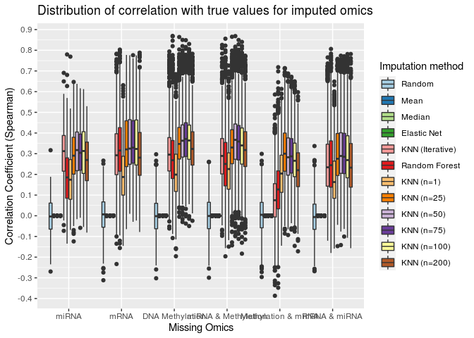

Imputation Plots
================

## Imputation plots and selecting the best imputation methods

The Omics\_Imputation.ipynb notebook in the folder was used to test a
variety of methods and various parameters on a small set of missing
omics, in order to find the best paramaters to the imputation methods.
Simple readymade methods were tried.

The imputation.py file in the folder is used to run the methods with
selected parameters on all combination of missing omics. It generates a
csv file containing spearman correlation values for each missing omics
combination, for each methods, for each feature.

This file is used to generate a box-plot for the spearman correlation
values, so as to determine the best imputation method to use.

Also, initially, RMSE and Stadard Deviation (a proxy for Variance) was
used in place of Spearman Correlation for evaluating the imputation
methods. The plots/csv files for the same can be found in
"/logs/202104\_\_/".

## Loading the data

``` r
spearman <- read_csv("spearman.csv")
```

    ## 
    ## ── Column specification ────────────────────────────────────────────────────────
    ## cols(
    ##   feature = col_character(),
    ##   method = col_character(),
    ##   missing_omics = col_character(),
    ##   Spearman = col_double()
    ## )

``` r
spearman2 <- read_csv("spearman2.csv")
```

    ## 
    ## ── Column specification ────────────────────────────────────────────────────────
    ## cols(
    ##   feature = col_character(),
    ##   method = col_character(),
    ##   missing_omics = col_character(),
    ##   Spearman = col_double()
    ## )

``` r
spearman <- rbind(spearman, spearman2)
summary(spearman)
```

    ##    feature             method          missing_omics         Spearman       
    ##  Length:162504      Length:162504      Length:162504      Min.   :-0.38670  
    ##  Class :character   Class :character   Class :character   1st Qu.: 0.00000  
    ##  Mode  :character   Mode  :character   Mode  :character   Median : 0.00000  
    ##                                                           Mean   : 0.09386  
    ##                                                           3rd Qu.: 0.17510  
    ##                                                           Max.   : 0.86919

``` r
head(spearman)
```

    ## # A tibble: 6 x 4
    ##   feature      method   missing_omics Spearman
    ##   <chr>        <chr>    <chr>            <dbl>
    ## 1 A4GALT|53947 enet     mirna                0
    ## 2 A4GALT|53947 knn1     mirna                0
    ## 3 A4GALT|53947 knn50    mirna                0
    ## 4 A4GALT|53947 knn_iter mirna                0
    ## 5 A4GALT|53947 mean     mirna                0
    ## 6 A4GALT|53947 median   mirna                0

## Processing the data

Adding a column stating what omics type any given feature belongs to.

``` r
meth <- read_csv("../R/TCGA BRCA/meth_top1000.csv", n_max = 1)
```

    ## 
    ## ── Column specification ────────────────────────────────────────────────────────
    ## cols(
    ##   .default = col_double(),
    ##   patient_id = col_character()
    ## )
    ## ℹ Use `spec()` for the full column specifications.

``` r
mrna <- read_csv("../R/TCGA BRCA/mrna_top1000.csv", n_max = 1)
```

    ## 
    ## ── Column specification ────────────────────────────────────────────────────────
    ## cols(
    ##   .default = col_double(),
    ##   patient_id = col_character()
    ## )
    ## ℹ Use `spec()` for the full column specifications.

``` r
mirna <- read_csv("../R/TCGA BRCA/mirna_anova.csv", n_max = 1)
```

    ## 
    ## ── Column specification ────────────────────────────────────────────────────────
    ## cols(
    ##   .default = col_double(),
    ##   patient_id = col_character()
    ## )
    ## ℹ Use `spec()` for the full column specifications.

``` r
spearman$datatype <- NA
spearman$datatype[spearman$feature %in% names(meth)] = "meth"
spearman$datatype[spearman$feature %in% names(mrna)] = "mrna"
spearman$datatype[spearman$feature %in% names(mirna)] = "mirna"

head(spearman)
```

    ## # A tibble: 6 x 5
    ##   feature      method   missing_omics Spearman datatype
    ##   <chr>        <chr>    <chr>            <dbl> <chr>   
    ## 1 A4GALT|53947 enet     mirna                0 mrna    
    ## 2 A4GALT|53947 knn1     mirna                0 mrna    
    ## 3 A4GALT|53947 knn50    mirna                0 mrna    
    ## 4 A4GALT|53947 knn_iter mirna                0 mrna    
    ## 5 A4GALT|53947 mean     mirna                0 mrna    
    ## 6 A4GALT|53947 median   mirna                0 mrna

Removing the rows that represent features that were not missing, which
consequently have zeros (in place of NaN) in the “Spearman” column.

``` r
spearman <- spearman %>%
  rowwise() %>%
  filter(grepl(datatype, missing_omics))

spearman$method <- fct_relevel(spearman$method, c("random", "mean", "median", "enet", "knn_iter", "rf", "knn1", "knn25", "knn50", "knn75", "knn100", "knn200"))
spearman$missing_omics <- fct_relevel(spearman$missing_omics, c("mirna", "mrna", "meth", "mirna meth", "meth mrna", "mrna mirna"))

head(spearman)
```

    ## # A tibble: 6 x 5
    ## # Rowwise: 
    ##   feature    method   missing_omics Spearman datatype
    ##   <chr>      <fct>    <fct>            <dbl> <chr>   
    ## 1 hsa-let-7c enet     mirna         8.94e-17 mirna   
    ## 2 hsa-let-7c knn1     mirna         3.60e- 2 mirna   
    ## 3 hsa-let-7c knn50    mirna         2.26e- 1 mirna   
    ## 4 hsa-let-7c knn_iter mirna         2.77e- 1 mirna   
    ## 5 hsa-let-7c mean     mirna         8.94e-17 mirna   
    ## 6 hsa-let-7c median   mirna         8.94e-17 mirna

## Box-plot

``` r
spearman %>%
  ggplot(aes(y = Spearman, x = missing_omics, fill = method)) +
  geom_boxplot()+
  labs(x="Missing Omics", y="Correlation Coefficient (Spearman)", fill="Imputation method",
       title="Distribution of correlation with true values for imputed omics")+
  scale_fill_brewer(palette = "Paired", labels = c("Random", "Mean", "Median", "Elastic Net", "KNN (Iterative)", "Random Forest", "KNN (n=1)", "KNN (n=25)", "KNN (n=50)", "KNN (n=75)", "KNN (n=100)", "KNN (n=200)"))+
  scale_y_continuous(breaks = round(seq(-1, 1, by = 0.1),1))+
  scale_x_discrete(labels = c("miRNA", "mRNA", "DNA Methylation", "miRNA & Methylation", "Methylation & mRNA", "mRNA & miRNA"))
```

<!-- -->

As can be inferred from the figure, KNN is the best choice to perform
imputation with.

KNN (Iterative) was performed with n=75. But if fails disproportionately
badly on the “Methylation and mRNA” set, where the omics present was
only miRNA. Similarly, KNN (n=25) performs particularly well for the
same set.

Among the KNNs, averaging over 50 neighbours appears to be the best
choice, while 25 neighbours is sometimes better. I believe that is so
because in the training set, the smallest class contained less than 50
samples. Increasing “n” beyond that would likely result in including too
many samples from other classes in the averaging process and thus reduce
correlation and usefulness of the imputation in classification
downstream.

This also implies that in case one trains the imputer on data sets
containing more samples in the smallest class, one can increase “n”
likewise for best results.
