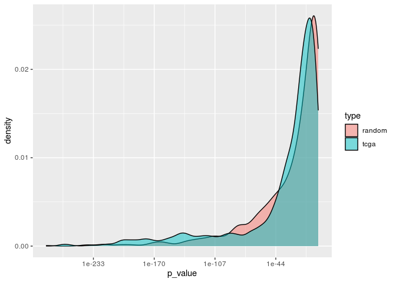
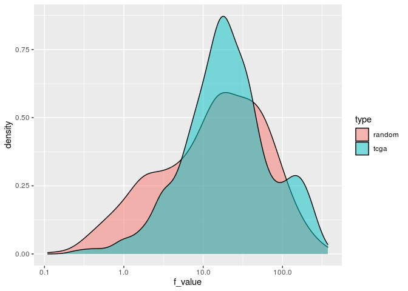

Biomarker Predictivity
================

## Independent Validation on METABRIC Data

Here, I validate the pre-processing and selection method used by showing
that the biomarkers selected on TCGA BRCA are useful for classification
on METABRIC data

### Custom Functions

``` r
# To perform ANOVA
run_anova <- function(train_data, train_labels, num_cpus=40) {
  num_cpus <- 40
  cl <- makeCluster(num_cpus)
  doParallel::registerDoParallel(cl)
  anova_summary <- foreach(i = 2:ncol(train_data)) %dopar% {
    column <- names(train_data[i]) 
    avz <- broom:: tidy(aov(train_data[,i][[1]] ~ unlist(train_labels$cancer_subtype))) # Each ANOVA test iterating through each column
    return(c(gene=column, f_value=avz$statistic[[1]], p_value=avz$p.value[[1]]))
  }
  stopCluster(cl)
  anova_summary <- as.data.frame(do.call(rbind, anova_summary), stringsAsFactors = FALSE)
  anova_summary <- transform(anova_summary, p_value = as.numeric(p_value), f_value = as.numeric(f_value))
  return(anova_summary)
}

# To transpose
transpose_df <- function(df) {
  t_df <- data.table::transpose(df)
  colnames(t_df) <- rownames(df)
  rownames(t_df) <- colnames(df)
  t_df <- t_df %>%
    tibble::rownames_to_column(.data = .) %>%
    tibble::as_tibble(.)
  return(t_df)
}
```

### Loading Data

TCGA mRNA
Expression

``` r
brca_genes <- read_csv("../R/TCGA BRCA/mrna_top1000.csv", n_max = 1, col_names = FALSE)
```

    ## 
    ## ── Column specification ────────────────────────────────────────────────────────
    ## cols(
    ##   .default = col_character()
    ## )
    ## ℹ Use `spec()` for the full column specifications.

``` r
brca_genes <- as.character(brca_genes[,2:1001])
brca_genes <- unlist(str_split(brca_genes, "\\|"))[ c(FALSE, TRUE) ]
```

METABRIC mRNA Expression

``` r
metabric <- read_csv("../R/METABRIC/metabric_mrna_common_genes.csv")
```

    ## 
    ## ── Column specification ────────────────────────────────────────────────────────
    ## cols(
    ##   .default = col_double(),
    ##   patient_id = col_character()
    ## )
    ## ℹ Use `spec()` for the full column specifications.

``` r
metabric_labels <- read_csv("../R/METABRIC/PAM50_metabric.csv")
```

    ## 
    ## ── Column specification ────────────────────────────────────────────────────────
    ## cols(
    ##   patient_id = col_character(),
    ##   cancer_subtype = col_character()
    ## )

This data has been pre-processed to have only those features that were
selected based on TCGA BRCA data beforehand. For details on the
processing, check the file at /R/METABRIC/dataprocessing.Rmd.

### ANOVA

``` r
anova_summary <- run_anova(metabric, metabric_labels, num_cpus=40)

median_pval <- median(anova_summary$p_value)
median_fval <- median(anova_summary$f_value)
```

## Random analysis

Here, I will select a random set of 1000 genes in the METABRIC mRNA
Expression data and then find it’s median F-value and
p-value.

### Loading raw data

``` r
colnames <- read_delim("../../metabric/EGAF00000102986/discovery_ExpressionMatrix.txt", 
    "\t", escape_double = FALSE, trim_ws = TRUE, n_max = 1, col_names = FALSE)
```

    ## 
    ## ── Column specification ────────────────────────────────────────────────────────
    ## cols(
    ##   .default = col_character()
    ## )
    ## ℹ Use `spec()` for the full column specifications.

``` r
colnames <- c("genes", as.character(colnames[1,]))

discovery <- read_delim("../../metabric/EGAF00000102986/discovery_ExpressionMatrix.txt", 
    "\t", escape_double = FALSE, trim_ws = TRUE, col_names = colnames, skip = 1)
```

    ## 
    ## ── Column specification ────────────────────────────────────────────────────────
    ## cols(
    ##   .default = col_double(),
    ##   genes = col_character()
    ## )
    ## ℹ Use `spec()` for the full column specifications.

``` r
colnames <- read_delim("../../metabric/EGAF00000102987/validation_ExpressionMatrix.txt", 
    " ", escape_double = FALSE, trim_ws = TRUE, n_max = 1, col_names = FALSE)
```

    ## 
    ## ── Column specification ────────────────────────────────────────────────────────
    ## cols(
    ##   .default = col_character()
    ## )
    ## ℹ Use `spec()` for the full column specifications.

``` r
colnames <- c("genes", as.character(colnames[1,]))

validation <- read_delim("../../metabric/EGAF00000102987/validation_ExpressionMatrix.txt", 
    " ", escape_double = FALSE, trim_ws = TRUE, col_names = colnames, skip = 1)
```

    ## 
    ## ── Column specification ────────────────────────────────────────────────────────
    ## cols(
    ##   .default = col_double(),
    ##   genes = col_character()
    ## )
    ## ℹ Use `spec()` for the full column specifications.

### Processing the data

The raw data needs quite a bit of processing to bring it to a more
presentable format

Converting the Illumina Gene IDs to Gene Symbols

``` r
# BiocManager::install("illuminaHumanv3.db")
library(illuminaHumanv3.db)
```

    ## Loading required package: AnnotationDbi

    ## Loading required package: stats4

    ## Loading required package: BiocGenerics

    ## 
    ## Attaching package: 'BiocGenerics'

    ## The following objects are masked from 'package:parallel':
    ## 
    ##     clusterApply, clusterApplyLB, clusterCall, clusterEvalQ,
    ##     clusterExport, clusterMap, parApply, parCapply, parLapply,
    ##     parLapplyLB, parRapply, parSapply, parSapplyLB

    ## The following objects are masked from 'package:dplyr':
    ## 
    ##     combine, intersect, setdiff, union

    ## The following objects are masked from 'package:stats':
    ## 
    ##     IQR, mad, sd, var, xtabs

    ## The following objects are masked from 'package:base':
    ## 
    ##     anyDuplicated, append, as.data.frame, basename, cbind, colnames,
    ##     dirname, do.call, duplicated, eval, evalq, Filter, Find, get, grep,
    ##     grepl, intersect, is.unsorted, lapply, Map, mapply, match, mget,
    ##     order, paste, pmax, pmax.int, pmin, pmin.int, Position, rank,
    ##     rbind, Reduce, rownames, sapply, setdiff, sort, table, tapply,
    ##     union, unique, unsplit, which, which.max, which.min

    ## Loading required package: Biobase

    ## Welcome to Bioconductor
    ## 
    ##     Vignettes contain introductory material; view with
    ##     'browseVignettes()'. To cite Bioconductor, see
    ##     'citation("Biobase")', and for packages 'citation("pkgname")'.

    ## Loading required package: IRanges

    ## Loading required package: S4Vectors

    ## 
    ## Attaching package: 'S4Vectors'

    ## The following objects are masked from 'package:data.table':
    ## 
    ##     first, second

    ## The following objects are masked from 'package:dplyr':
    ## 
    ##     first, rename

    ## The following object is masked from 'package:tidyr':
    ## 
    ##     expand

    ## The following object is masked from 'package:base':
    ## 
    ##     expand.grid

    ## 
    ## Attaching package: 'IRanges'

    ## The following object is masked from 'package:data.table':
    ## 
    ##     shift

    ## The following objects are masked from 'package:dplyr':
    ## 
    ##     collapse, desc, slice

    ## The following object is masked from 'package:purrr':
    ## 
    ##     reduce

    ## 
    ## Attaching package: 'AnnotationDbi'

    ## The following object is masked from 'package:dplyr':
    ## 
    ##     select

    ## Loading required package: org.Hs.eg.db

    ## 

    ## 

``` r
genes <- discovery$genes
genes <- data.frame(Gene=unlist(mget(x = genes, envir = illuminaHumanv3ENTREZREANNOTATED)))

discovery$genes <- genes$Gene

genes <- validation$genes
genes <- data.frame(Gene=unlist(mget(x = genes, envir = illuminaHumanv3ENTREZREANNOTATED)))

validation$genes <- genes$Gene
rm(genes)
```

Removing NAs and summarising over duplicates

``` r
discovery <- discovery[complete.cases(discovery), ] %>%
      group_by(genes) %>%
      summarize(across(everything(), list(mean))) #%>%
#      remove_rownames() %>%
#      column_to_rownames("genes")

validation <- validation[complete.cases(validation), ] %>%
      group_by(genes) %>%
      summarize(across(everything(), list(mean))) #%>%
#      remove_rownames() %>%
#      column_to_rownames("genes")
```

Selecting only those features common to both discovery and validation
sets

``` r
common_genes <- intersect(discovery$genes, validation$genes)

metabric_d <- discovery %>%
  filter(genes %in% common_genes) %>%
  remove_rownames() %>%
  column_to_rownames("genes")

metabric_v <- validation %>%
  filter(genes %in% common_genes) %>%
  remove_rownames() %>%
  column_to_rownames("genes")

setdiff(metabric_d$genes, metabric_v$genes)
```

    ## NULL

Transposing and then combining the discovery and validation sets

``` r
metabric_d <- transpose_df(metabric_d) %>%
  dplyr::rename(patient_id = "rowname")
metabric_d$patient_id <- unlist(str_split(metabric_d$patient_id, "\\_"))[c(TRUE, FALSE)]

metabric_v <- transpose_df(metabric_v) %>%
  dplyr::rename(patient_id = "rowname")
metabric_v$patient_id <- unlist(str_split(metabric_v$patient_id, "\\_"))[c(TRUE, FALSE)]

metabric_complete <- rbind(metabric_d, metabric_v)
metabric_complete <- metabric_complete[match(metabric_labels$patient_id, metabric_complete$patient_id),]
```

### Selecting Random Features

``` r
feature_list <- names(metabric_complete)[2:ncol(metabric_complete)]
set.seed(42)
random_sample <- sample(feature_list, 953)
# Adding "patient_id" column to random_sample
random_sample <- c("patient_id", random_sample)
```

### ANOVA

``` r
anova_summary_random <- metabric_complete %>%
  dplyr::select(random_sample) %>%
  run_anova(metabric_labels, num_cpus=20)
```

    ## Note: Using an external vector in selections is ambiguous.
    ## ℹ Use `all_of(random_sample)` instead of `random_sample` to silence this message.
    ## ℹ See <https://tidyselect.r-lib.org/reference/faq-external-vector.html>.
    ## This message is displayed once per session.

``` r
median_pval_random <- median(anova_summary_random$p_value)
median_fval_random <- median(anova_summary_random$f_value)
```

## Comparison

``` r
summary(anova_summary$p_value)
```

    ##    Min. 1st Qu.  Median    Mean 3rd Qu.    Max. 
    ##  0.0000  0.0000  0.0000  0.0168  0.0000  0.9422

``` r
summary(anova_summary_random$p_value)
```

    ##      Min.   1st Qu.    Median      Mean   3rd Qu.      Max. 
    ## 0.0000000 0.0000000 0.0000000 0.0660477 0.0004453 0.9901804

``` r
median_pval
```

    ## [1] 1.369561e-18

``` r
median_pval_random
```

    ## [1] 4.594055e-15

``` r
summary(anova_summary$f_value)
```

    ##     Min.  1st Qu.   Median     Mean  3rd Qu.     Max. 
    ##   0.2453   9.4047  19.0877  40.6761  40.6425 344.2774

``` r
summary(anova_summary_random$f_value)
```

    ##     Min.  1st Qu.   Median     Mean  3rd Qu.     Max. 
    ##   0.1099   4.4958  15.5798  32.1232  42.6310 373.1939

``` r
median_fval
```

    ## [1] 19.08768

``` r
median_fval_random
```

    ## [1] 15.57984

``` r
df <- tibble(
  type = c(rep("tcga", nrow(anova_summary)), rep("random", nrow(anova_summary_random))),
  f_value = c(anova_summary$f_value, anova_summary_random$f_value),
  p_value = c(anova_summary$p_value, anova_summary_random$p_value)
)
```

``` r
ggplot(df, aes(x=p_value, fill=type))+
  geom_density(alpha=0.5)+
  scale_x_continuous(trans='log10')
```

<!-- -->

``` r
ggplot(df, aes(x=f_value, fill=type))+
  geom_density(alpha=0.5)+
  scale_x_continuous(trans='log10')
```

<!-- -->
