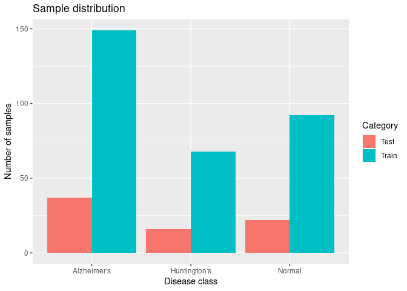

Data Split and Label Recovery
================

In this notebook, I will get the labels from the data and then format
them as needed and also split the data into training and testing
splits.

## Loading data

``` r
data <- read_delim("../../../HBTRC_data/GN326_MeanDataAnnotated_rev081815.txt", "\t", escape_double = FALSE, trim_ws = TRUE, skip = 32)
```

``` r
# Getting the Gene Symbol and description and storing them as an annotation file
annotation <- data %>%
  select("Gene Symbol", "Gene Id", Description) %>%
  rename(Gene_Symbol = "Gene Symbol", GeneID = "Gene Id") %>%
  filter(GeneID != "None") %>%
  distinct(Gene_Symbol, .keep_all = TRUE)

write_csv(annotation, "gene_description.csv")
```

## Labels

We will load the header row of each tissue type to get the sample ids
present. Then we will find the common samples among them and use only
those for the
analysis.

``` r
tissue1 <- read_delim("../../../HBTRC_data/GN326_MeanDataAnnotated_rev081815.txt", "\t", escape_double = FALSE, trim_ws = TRUE, skip = 32, n_max = 0) %>% select(starts_with("HB")) %>% names()
tissue2 <- read_delim("../../../HBTRC_data/GN327_MeanDataAnnotated_rev081815.txt", "\t", escape_double = FALSE, trim_ws = TRUE, skip = 32, n_max = 0) %>% select(starts_with("HB")) %>% names()
tissue3 <- read_delim("../../../HBTRC_data/GN328_MeanDataAnnotated_rev081815.txt", "\t", escape_double = FALSE, trim_ws = TRUE, skip = 32, n_max = 0) %>% select(starts_with("HB")) %>% names()

common_samples <- intersect(intersect(tissue1, tissue2), tissue3)
```

``` r
#Below is the format for getting label infromation from the sample id
pattern <- "^\\w{2}\\_\\w{3}\\_(\\w*)$"

#Now to get samples' labels using that format
labels <- sub(pattern, "\\1", common_samples)
labels <- recode(labels, "N"="Normal", "AD"="Alzheimer's", "HD"="Huntington's")

label_df <- tibble(Samples=common_samples, Labels=labels)
```

### Stratified Random Split

``` r
train.index <- createDataPartition(label_df$Labels, p = .8, list = FALSE)
train <- label_df[ train.index,]
test  <- label_df[-train.index,]
```

## Writing files

### The disease\_class file

``` r
label_df %>%
  rename(patient_id = "Samples", class = "Labels") %>%
  write.csv("disease_class.csv", row.names = FALSE)
```

## The train-test partition file

``` r
fileConn<-file("trte_partition.txt")
writeLines(c("training patient_id", paste(unlist(train["Samples"]), collapse = ","), "testing patient_id", paste(unlist(test["Samples"]), collapse = ",")), fileConn)
close(fileConn)
```

``` r
label_df$Category <- ifelse(label_df$Samples %in% train$Samples, "Train", "Test")

label_df %>%
  ggplot(aes(x=Labels, group=Category, fill=Category))+
  geom_bar(position="dodge")+
  labs(x="Disease class", y="Number of samples", title = "Sample distribution")
```

<!-- -->

``` r
(Number_of_train_samples = length(train.index))
```

    ## [1] 309

``` r
(Number_of_test_samples = nrow(label_df) - length(train.index))
```

    ## [1] 75

``` r
(Total_samples = nrow(label_df))
```

    ## [1] 384
