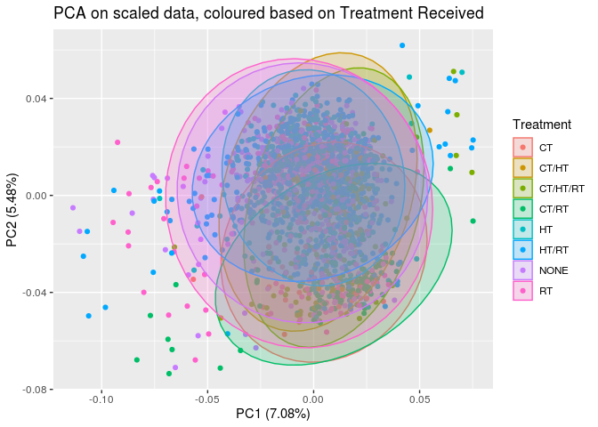
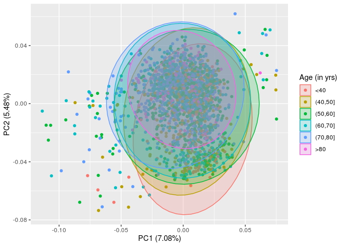

Data Preliminaries
================

## Loading data

``` r
data.top1000 <- read_csv("metabric_mrna_common_genes.csv")

colnames <- read_delim("../../../metabric/EGAF00000102986/discovery_ExpressionMatrix.txt", 
    "\t", escape_double = FALSE, trim_ws = TRUE, n_max = 1, col_names = FALSE)
colnames <- c("genes", as.character(colnames[1,]))

discovery <- read_delim("../../../metabric/EGAF00000102986/discovery_ExpressionMatrix.txt", 
    "\t", escape_double = FALSE, trim_ws = TRUE, col_names = colnames, skip = 1)

colnames <- read_delim("../../../metabric/EGAF00000102987/validation_ExpressionMatrix.txt", 
    " ", escape_double = FALSE, trim_ws = TRUE, n_max = 1, col_names = FALSE)
colnames <- c("genes", as.character(colnames[1,]))

validation <- read_delim("../../../metabric/EGAF00000102987/validation_ExpressionMatrix.txt", 
    " ", escape_double = FALSE, trim_ws = TRUE, col_names = colnames, skip = 1)

labels_discovery <- read_delim("clinical_data_discovery.txt", "\t") %>% 
                      dplyr::rename(patient_id = METABRIC_ID, cancer_subtype = Pam50Subtype)
labels_validation <- read_delim("clinical_data_validation.txt", "\t") %>% 
                      dplyr::rename(patient_id = METABRIC_ID, cancer_subtype = Pam50Subtype)
rm(colnames)
```

Converting the Illumina Gene IDs to Gene Symbols

``` r
library(illuminaHumanv3.db)
```

    ## Loading required package: AnnotationDbi

    ## Loading required package: stats4

    ## Loading required package: BiocGenerics

    ## Loading required package: parallel

    ## 
    ## Attaching package: 'BiocGenerics'

    ## The following objects are masked from 'package:parallel':
    ## 
    ##     clusterApply, clusterApplyLB, clusterCall, clusterEvalQ,
    ##     clusterExport, clusterMap, parApply, parCapply, parLapply,
    ##     parLapplyLB, parRapply, parSapply, parSapplyLB

    ## The following objects are masked from 'package:dplyr':
    ## 
    ##     combine, intersect, setdiff, union

    ## The following objects are masked from 'package:stats':
    ## 
    ##     IQR, mad, sd, var, xtabs

    ## The following objects are masked from 'package:base':
    ## 
    ##     anyDuplicated, append, as.data.frame, basename, cbind, colnames,
    ##     dirname, do.call, duplicated, eval, evalq, Filter, Find, get, grep,
    ##     grepl, intersect, is.unsorted, lapply, Map, mapply, match, mget,
    ##     order, paste, pmax, pmax.int, pmin, pmin.int, Position, rank,
    ##     rbind, Reduce, rownames, sapply, setdiff, sort, table, tapply,
    ##     union, unique, unsplit, which, which.max, which.min

    ## Loading required package: Biobase

    ## Welcome to Bioconductor
    ## 
    ##     Vignettes contain introductory material; view with
    ##     'browseVignettes()'. To cite Bioconductor, see
    ##     'citation("Biobase")', and for packages 'citation("pkgname")'.

    ## Loading required package: IRanges

    ## Loading required package: S4Vectors

    ## 
    ## Attaching package: 'S4Vectors'

    ## The following objects are masked from 'package:dplyr':
    ## 
    ##     first, rename

    ## The following object is masked from 'package:tidyr':
    ## 
    ##     expand

    ## The following object is masked from 'package:base':
    ## 
    ##     expand.grid

    ## 
    ## Attaching package: 'IRanges'

    ## The following objects are masked from 'package:dplyr':
    ## 
    ##     collapse, desc, slice

    ## The following object is masked from 'package:purrr':
    ## 
    ##     reduce

    ## 
    ## Attaching package: 'AnnotationDbi'

    ## The following object is masked from 'package:dplyr':
    ## 
    ##     select

    ## Loading required package: org.Hs.eg.db

    ## 

    ## 

``` r
genes <- discovery$genes
genes <- data.frame(Gene=unlist(mget(x = genes, envir = illuminaHumanv3ENTREZREANNOTATED)))

discovery$genes <- genes$Gene

genes <- validation$genes
genes <- data.frame(Gene=unlist(mget(x = genes, envir = illuminaHumanv3ENTREZREANNOTATED)))

validation$genes <- genes$Gene
rm(genes)
```

Removing NAs and summarising over duplicates

``` r
discovery <- discovery[complete.cases(discovery), ] %>%
      group_by(genes) %>%
      summarize(across(everything(), list(mean)))

validation <- validation[complete.cases(validation), ] %>%
      group_by(genes) %>%
      summarize(across(everything(), list(mean)))
```

## Filtering data

``` r
common_genes <- intersect(discovery$genes, validation$genes)

metabric_d <- discovery %>%
  filter(genes %in% common_genes) %>%
  remove_rownames() %>%
  column_to_rownames("genes")

metabric_v <- validation %>%
  filter(genes %in% common_genes) %>%
  remove_rownames() %>%
  column_to_rownames("genes")

setdiff(metabric_d$genes, metabric_v$genes)
```

    ## NULL

``` r
clinical <- rbind(labels_discovery, labels_validation)
toBeRemoved <- clinical$patient_id[clinical$cancer_subtype == "NC"]
clinical <- filter(clinical, !patient_id %in% toBeRemoved)

metabric_d <- transpose_df(metabric_d) %>%
  dplyr::rename(patient_id = "rowname")
metabric_d$patient_id <- unlist(str_split(metabric_d$patient_id, "\\_"))[c(TRUE, FALSE)]

metabric_d <- filter(metabric_d, !patient_id %in% toBeRemoved)

metabric_v <- transpose_df(metabric_v) %>%
  dplyr::rename(patient_id = "rowname")
metabric_v$patient_id <- unlist(str_split(metabric_v$patient_id, "\\_"))[c(TRUE, FALSE)]

metabric_v <- filter(metabric_v, !patient_id %in% toBeRemoved)

data <- rbind(metabric_d, metabric_v)
```

## Processing

``` r
meta_and_data <- left_join(data, clinical, by = "patient_id") %>%
  mutate(Site = as.factor(Site)) %>%
  dplyr::rename(Subtype = cancer_subtype,
                Age = age_at_diagnosis,
                Cellularity = cellularity)

meta_and_data$Set <- NULL
meta_and_data$Set[meta_and_data$patient_id %in% metabric_d$patient_id] = "Discovery"
```

    ## Warning: Unknown or uninitialised column: `Set`.

``` r
meta_and_data$Set[meta_and_data$patient_id %in% metabric_v$patient_id] = "Validation"
```

## Performing Principal Component Analysis

``` r
metabric.pca <- prcomp(data[,c(2:19871)], center = TRUE, scale. = TRUE)
str(metabric.pca)
```

    ## List of 5
    ##  $ sdev    : num [1:1986] 37.5 33 28.3 23.1 19.8 ...
    ##  $ rotation: num [1:19870, 1:1986] -0.004552 0.000653 0.005338 0.003021 0.002274 ...
    ##   ..- attr(*, "dimnames")=List of 2
    ##   .. ..$ : chr [1:19870] "1" "10" "100" "1000" ...
    ##   .. ..$ : chr [1:1986] "PC1" "PC2" "PC3" "PC4" ...
    ##  $ center  : Named num [1:19870] 5.52 5.52 7.57 7.27 5.49 ...
    ##   ..- attr(*, "names")= chr [1:19870] "1" "10" "100" "1000" ...
    ##  $ scale   : Named num [1:19870] 0.1008 0.4219 0.6204 0.9848 0.0982 ...
    ##   ..- attr(*, "names")= chr [1:19870] "1" "10" "100" "1000" ...
    ##  $ x       : num [1:1986, 1:1986] -5.87 -9.02 10.11 -10.2 21.09 ...
    ##   ..- attr(*, "dimnames")=List of 2
    ##   .. ..$ : NULL
    ##   .. ..$ : chr [1:1986] "PC1" "PC2" "PC3" "PC4" ...
    ##  - attr(*, "class")= chr "prcomp"

``` r
metabric.top1000.pca <- prcomp(data.top1000[,c(2:954)], center = TRUE, scale. = TRUE)
str(metabric.top1000.pca)
```

    ## List of 5
    ##  $ sdev    : num [1:953] 9.51 8.41 6.7 5.83 4.72 ...
    ##  $ rotation: num [1:953, 1:953] -0.0103 0.0205 -0.0154 -0.0323 0.0227 ...
    ##   ..- attr(*, "dimnames")=List of 2
    ##   .. ..$ : chr [1:953] "10001" "10011" "100133941" "100272147" ...
    ##   .. ..$ : chr [1:953] "PC1" "PC2" "PC3" "PC4" ...
    ##  $ center  : Named num [1:953] 8.94 6.76 10.83 9.06 7.34 ...
    ##   ..- attr(*, "names")= chr [1:953] "10001" "10011" "100133941" "100272147" ...
    ##  $ scale   : Named num [1:953] 0.327 0.309 1.439 0.425 0.585 ...
    ##   ..- attr(*, "names")= chr [1:953] "10001" "10011" "100133941" "100272147" ...
    ##  $ x       : num [1:1986, 1:953] -4.142 -7.327 -9.659 0.852 2.32 ...
    ##   ..- attr(*, "dimnames")=List of 2
    ##   .. ..$ : NULL
    ##   .. ..$ : chr [1:953] "PC1" "PC2" "PC3" "PC4" ...
    ##  - attr(*, "class")= chr "prcomp"

## Checking for covairates

### Tissue and Clinical Data Source Site

``` r
autoplot(metabric.pca, data=meta_and_data, colour="Site", frame=TRUE, frame.type="norm") +
  labs(title = "PCA on scaled data, coloured based on tissue source site")
```

    ## Warning: `select_()` was deprecated in dplyr 0.7.0.
    ## Please use `select()` instead.

<!-- -->

### Treatment Received

``` r
autoplot(metabric.pca, data=meta_and_data, colour="Treatment", frame=TRUE, frame.type="norm") +
  labs(title = "PCA on scaled data, coloured based on Treatment Received")
```

<!-- -->

### Cancer Subtype

``` r
autoplot(metabric.pca, data=meta_and_data, colour="Subtype", frame=TRUE, frame.type="norm") +
  labs(title = "PCA on scaled data, coloured based on Breast Cancer Subtype")
```

<!-- -->

### Age

``` r
autoplot(metabric.pca, data=meta_and_data, colour="Age", frame=TRUE, frame.type="norm") +
  labs(title = "PCA on scaled data, coloured based on Age")
```

<!-- -->

### Cancer Cellularity

``` r
autoplot(metabric.pca, data=meta_and_data, colour="Cellularity", frame=TRUE, frame.type="norm") +
  labs(title = "PCA on scaled data, coloured based on Cancer Cellularity")
```

<!-- -->
