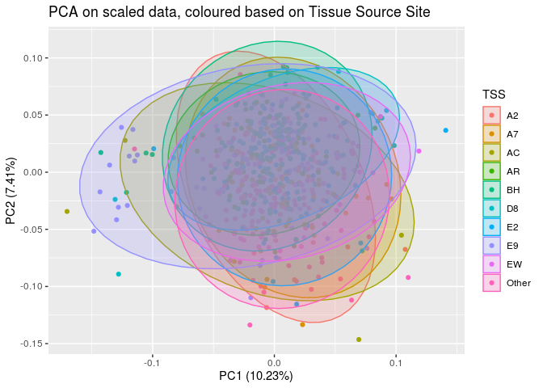

Data Preliminaries
================

# Checking for Covariates

## Loading data

``` r
mrna <- read_csv("mrna_top1000.csv")
meth <- read_csv("meth_top1000.csv")
mirna <- read_csv("mirna_anova.csv")
pam50 <- read_csv("PAM50_subtype.csv")

data <- left_join(left_join(mrna, meth, by = "patient_id"), mirna, by = "patient_id")
data <- left_join(data, pam50, "patient_id")

data$patient_id <- str_sub(data$patient_id, 1, 12)
```

## Loading metadata and making it presentable

``` r
BRCA_clin_merged_picked <- read_delim("../../../firehose/stddata__2016_01_28/BRCA/20160128/gdac.broadinstitute.org_BRCA.Clinical_Pick_Tier1.Level_4.2016012800.0.0/BRCA.clin.merged.picked.txt", 
    "\t", escape_double = FALSE, trim_ws = TRUE)

clinical1 <- BRCA_clin_merged_picked %>% 
              column_to_rownames(var="Hybridization REF") %>%
              transpose_df() %>%
              dplyr::rename("patient_id" = "rowname")

All_CDEs <- read_delim("../../../firehose/stddata__2016_01_28/BRCA/20160128/gdac.broadinstitute.org_BRCA.Clinical_Pick_Tier1.Level_4.2016012800.0.0/All_CDEs.txt", 
    "\t", escape_double = FALSE, trim_ws = TRUE)

clinical2 <- All_CDEs %>% 
              column_to_rownames(var="bcr_patient_barcode") %>%
              transpose_df() %>%
              dplyr::select(-patient_id) %>%
              dplyr::rename("patient_id" = "rowname")

clinical <- inner_join(clinical1, clinical2, by = "patient_id") 
#dplyr::select(intersect(names(clinical1), names(clinical2)))

clinical$patient_id <- str_to_upper(clinical$patient_id)
```

## Obtaining TSS from Patient Barcode

TSS = Tissue Source Site

``` r
data$TSS <- str_sub(data$patient_id, 6, 7)
```

## Filtering data

``` r
patients <- intersect(data$patient_id, clinical$patient_id)

# Data
data <- data %>%
  dplyr::filter(patient_id %in% patients)

# Clinical data
clinical <- clinical %>%
  dplyr:: filter(patient_id %in% patients)

meta_and_data <- left_join(data, clinical, by = "patient_id") %>%
  dplyr::rename("Subtype" = "cancer_subtype",
                "Age" = "age_at_initial_pathologic_diagnosis",
                "Race" = "race.x",
                "Ethnicity" = "ethnicity.x") %>%
  mutate(Age = as.numeric(Age),
         TSS = fct_lump_n(TSS, n=9))
```

## Performing Principal Component Analysis

``` r
tcga.pca <- prcomp(data[,c(2:2258)], center = TRUE, scale. = TRUE)
#summary(tcga.pca)
str(tcga.pca)
```

    ## List of 5
    ##  $ sdev    : num [1:622] 15.2 12.93 12.15 10.45 8.58 ...
    ##  $ rotation: num [1:2257, 1:622] 0.00397 -0.01341 -0.01145 0.00758 0.01078 ...
    ##   ..- attr(*, "dimnames")=List of 2
    ##   .. ..$ : chr [1:2257] "DBF4|10926" "DACH1|1602" "BBS4|585" "L3MBTL4|91133" ...
    ##   .. ..$ : chr [1:622] "PC1" "PC2" "PC3" "PC4" ...
    ##  $ center  : Named num [1:2257] 7.94 7.95 8.71 5.68 9.52 ...
    ##   ..- attr(*, "names")= chr [1:2257] "DBF4|10926" "DACH1|1602" "BBS4|585" "L3MBTL4|91133" ...
    ##  $ scale   : Named num [1:2257] 0.815 2.411 0.723 1.678 1.49 ...
    ##   ..- attr(*, "names")= chr [1:2257] "DBF4|10926" "DACH1|1602" "BBS4|585" "L3MBTL4|91133" ...
    ##  $ x       : num [1:622, 1:622] -3.088 0.799 -31.351 -14.137 26.058 ...
    ##   ..- attr(*, "dimnames")=List of 2
    ##   .. ..$ : NULL
    ##   .. ..$ : chr [1:622] "PC1" "PC2" "PC3" "PC4" ...
    ##  - attr(*, "class")= chr "prcomp"

## Checking for covairates

### Tissue Source Site

``` r
autoplot(tcga.pca, data=meta_and_data, colour="TSS", frame=TRUE, frame.type="norm") +
  labs(title = "PCA on scaled data, coloured based on Tissue Source Site")
```

    ## Warning: `select_()` was deprecated in dplyr 0.7.0.
    ## Please use `select()` instead.

<!-- -->

### Sequencing Center

All tissue samples were taken from cold storage and then sequenced in
the same center. Different omics data was generated at different
centers, but all samples’ individual omics was generated at the same
center.

### Cancer Subtype

``` r
autoplot(tcga.pca, data=meta_and_data, colour="Subtype", frame=TRUE, frame.type="norm") +
  labs(title = "PCA on scaled data, coloured based on Breast Cancer Subtype")
```

<!-- -->

### Age

``` r
autoplot(tcga.pca, data=meta_and_data, colour="Age", frame=TRUE, frame.type="norm") +
  labs(title = "PCA on scaled data, coloured based on Age")
```

<!-- -->

### Race

``` r
autoplot(tcga.pca, data=meta_and_data, colour="Race", frame=TRUE, frame.type="norm") +
  labs(title = "PCA on scaled data, coloured based on Race")
```

<!-- -->

### Ethnicity

``` r
autoplot(tcga.pca, data=meta_and_data, colour="Ethnicity", frame=TRUE, frame.type="norm") +
  labs(title = "PCA on scaled data, coloured based on Ethnicity")
```

<!-- -->

# Scaling and Centering data

### mRNA Expression

``` r
data <- read_csv("mrna_top1000.csv")
trte <- read.csv("trte_partition.txt", header=FALSE, colClasses = "character")
train <- as.character(trte[2,])
train <- train[train != ""]
test <- as.character(trte[4,])
test <- test[test != ""]

data_train <- filter(data, patient_id %in% train)
data_test <- filter(data, patient_id %in% test)

mean <- apply(data_train[2:1001], 2, mean)
std <- apply(data_train[2:1001], 2, sd)

data_train[2:1001] <- scale(data_train[2:1001], center = mean, scale = std)
data_test[2:1001] <- scale(data_test[2:1001], center = mean, scale = std)

new_data <- rbind(data_train, data_test)
data <- new_data[match(data$patient_id, new_data$patient_id),]
write_csv(data, "mrna_top1000_scaled.csv")
```

### DNA Methylation

``` r
data <- read_csv("meth_top1000.csv")
trte <- read.csv("trte_partition.txt", header=FALSE, colClasses = "character")
train <- as.character(trte[2,])
train <- train[train != ""]
test <- as.character(trte[4,])
test <- test[test != ""]

data_train <- filter(data, patient_id %in% train)
data_test <- filter(data, patient_id %in% test)

mean <- apply(data_train[2:1001], 2, mean)
std <- apply(data_train[2:1001], 2, sd)

data_train[2:1001] <- scale(data_train[2:1001], center = mean, scale = std)
data_test[2:1001] <- scale(data_test[2:1001], center = mean, scale = std)

new_data <- rbind(data_train, data_test)
data <- new_data[match(data$patient_id, new_data$patient_id),]
write_csv(data, "meth_top1000_scaled.csv")
```

### miRNA Expression

``` r
data <- read_csv("mirna_anova.csv")
trte <- read.csv("trte_partition.txt", header=FALSE, colClasses = "character")
train <- as.character(trte[2,])
train <- train[train != ""]
test <- as.character(trte[4,])
test <- test[test != ""]

data_train <- filter(data, patient_id %in% train)
data_test <- filter(data, patient_id %in% test)

mean <- apply(data_train[2:258], 2, mean)
std <- apply(data_train[2:258], 2, sd)

data_train[2:258] <- scale(data_train[2:258], center = mean, scale = std)
data_test[2:258] <- scale(data_test[2:258], center = mean, scale = std)

new_data <- rbind(data_train, data_test)
data <- new_data[match(data$patient_id, new_data$patient_id),]
write_csv(data, "mirna_anova_scaled.csv")
```

### mRNA Expression X mRNA Expression

``` r
data <- read_csv("mrna_mrna_anova.csv")
trte <- read.csv("trte_partition.txt", header=FALSE, colClasses = "character")
train <- as.character(trte[2,])
train <- train[train != ""]
test <- as.character(trte[4,])
test <- test[test != ""]

data_train <- filter(data, patient_id %in% train)
data_test <- filter(data, patient_id %in% test)

mean <- apply(data_train[2:1001], 2, mean)
std <- apply(data_train[2:1001], 2, sd)

data_train[2:1001] <- scale(data_train[2:1001], center = mean, scale = std)
data_test[2:1001] <- scale(data_test[2:1001], center = mean, scale = std)

new_data <- rbind(data_train, data_test)
data <- new_data[match(data$patient_id, new_data$patient_id),]
write_csv(data, "mrna_mrna_anova_scaled.csv")
```

### DNA Methylation X DNA Methylation

``` r
data <- read_csv("meth_meth_anova.csv")
trte <- read.csv("trte_partition.txt", header=FALSE, colClasses = "character")
train <- as.character(trte[2,])
train <- train[train != ""]
test <- as.character(trte[4,])
test <- test[test != ""]

data_train <- filter(data, patient_id %in% train)
data_test <- filter(data, patient_id %in% test)

mean <- apply(data_train[2:1001], 2, mean)
std <- apply(data_train[2:1001], 2, sd)

data_train[2:1001] <- scale(data_train[2:1001], center = mean, scale = std)
data_test[2:1001] <- scale(data_test[2:1001], center = mean, scale = std)

new_data <- rbind(data_train, data_test)
data <- new_data[match(data$patient_id, new_data$patient_id),]
write_csv(data, "meth_meth_anova_scaled.csv")
```

### miRNA Expression X miRNA Expression

``` r
data <- read_csv("mirna_mirna_anova.csv")
trte <- read.csv("trte_partition.txt", header=FALSE, colClasses = "character")
train <- as.character(trte[2,])
train <- train[train != ""]
test <- as.character(trte[4,])
test <- test[test != ""]

data_train <- filter(data, patient_id %in% train)
data_test <- filter(data, patient_id %in% test)

mean <- apply(data_train[2:630], 2, mean)
std <- apply(data_train[2:630], 2, sd)

data_train[2:630] <- scale(data_train[2:630], center = mean, scale = std)
data_test[2:630] <- scale(data_test[2:630], center = mean, scale = std)

new_data <- rbind(data_train, data_test)
data <- new_data[match(data$patient_id, new_data$patient_id),]
write_csv(data, "mirna_mirna_anova_scaled.csv")
```

### mRNA Expression X DNA Methylation

``` r
data <- read_csv("meth_mrna_anova.csv")
trte <- read.csv("trte_partition.txt", header=FALSE, colClasses = "character")
train <- as.character(trte[2,])
train <- train[train != ""]
test <- as.character(trte[4,])
test <- test[test != ""]

data_train <- filter(data, patient_id %in% train)
data_test <- filter(data, patient_id %in% test)

mean <- apply(data_train[2:1001], 2, mean)
std <- apply(data_train[2:1001], 2, sd)

data_train[2:1001] <- scale(data_train[2:1001], center = mean, scale = std)
data_test[2:1001] <- scale(data_test[2:1001], center = mean, scale = std)

new_data <- rbind(data_train, data_test)
data <- new_data[match(data$patient_id, new_data$patient_id),]
write_csv(data, "meth_mrna_anova_scaled.csv")
```

### DNA Methylation X miRNA Expression

``` r
data <- read_csv("meth_mirna_anova.csv")
trte <- read.csv("trte_partition.txt", header=FALSE, colClasses = "character")
train <- as.character(trte[2,])
train <- train[train != ""]
test <- as.character(trte[4,])
test <- test[test != ""]

data_train <- filter(data, patient_id %in% train)
data_test <- filter(data, patient_id %in% test)

mean <- apply(data_train[2:1001], 2, mean)
std <- apply(data_train[2:1001], 2, sd)

data_train[2:1001] <- scale(data_train[2:1001], center = mean, scale = std)
data_test[2:1001] <- scale(data_test[2:1001], center = mean, scale = std)

new_data <- rbind(data_train, data_test)
data <- new_data[match(data$patient_id, new_data$patient_id),]
write_csv(data, "meth_mirna_anova_scaled.csv")
```

### miRNA Expression X mRNA Expression

``` r
data <- read_csv("mrna_mirna_anova.csv")
trte <- read.csv("trte_partition.txt", header=FALSE, colClasses = "character")
train <- as.character(trte[2,])
train <- train[train != ""]
test <- as.character(trte[4,])
test <- test[test != ""]

data_train <- filter(data, patient_id %in% train)
data_test <- filter(data, patient_id %in% test)

mean <- apply(data_train[2:802], 2, mean)
std <- apply(data_train[2:802], 2, sd)

data_train[2:802] <- scale(data_train[2:802], center = mean, scale = std)
data_test[2:802] <- scale(data_test[2:802], center = mean, scale = std)

new_data <- rbind(data_train, data_test)
data <- new_data[match(data$patient_id, new_data$patient_id),]
write_csv(data, "mrna_mirna_anova_scaled.csv")
```
