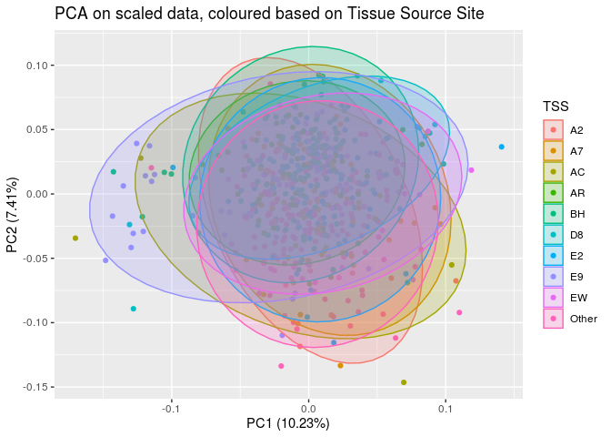
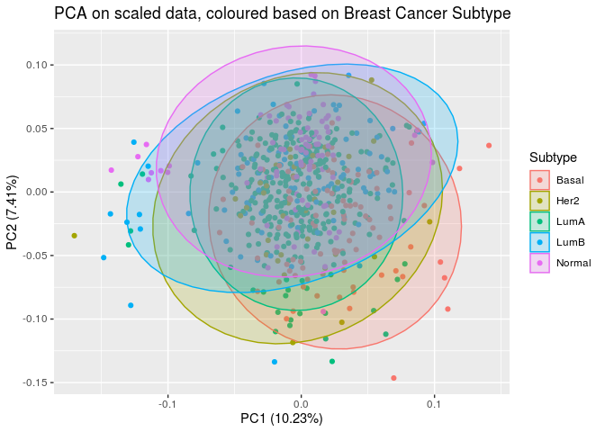
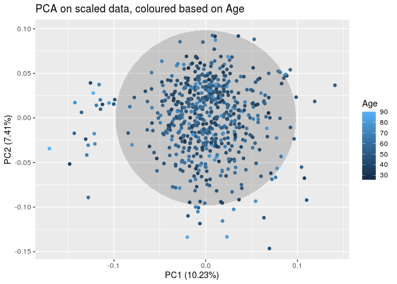
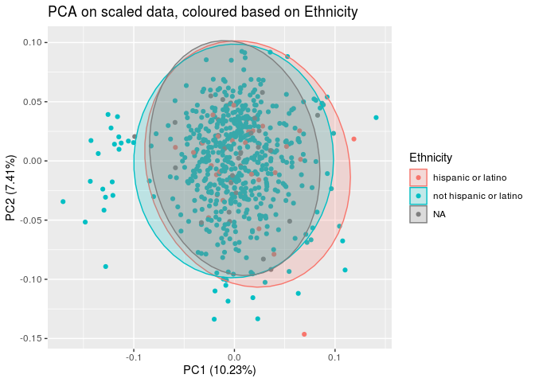

Data Preliminaries
================

## Custom functions

``` r
# To transpose
transpose_df <- function(df) {
  t_df <- data.table::transpose(df)
  colnames(t_df) <- rownames(df)
  rownames(t_df) <- colnames(df)
  t_df <- t_df %>%
    tibble::rownames_to_column(.data = .) %>%
    tibble::as_tibble(.)
  return(t_df)
}
```

## Loading data

``` r
mrna <- read_csv("mrna_top1000.csv")
meth <- read_csv("meth_top1000.csv")
mirna <- read_csv("mirna_anova.csv")
pam50 <- read_csv("PAM50_subtype.csv")

data <- left_join(left_join(mrna, meth, by = "patient_id"), mirna, by = "patient_id")
data <- left_join(data, pam50, "patient_id")

data$patient_id <- str_sub(data$patient_id, 1, 12)
```

## Loading metadata and making it presentable

``` r
BRCA_clin_merged_picked <- read_delim("../../../firehose/stddata__2016_01_28/BRCA/20160128/gdac.broadinstitute.org_BRCA.Clinical_Pick_Tier1.Level_4.2016012800.0.0/BRCA.clin.merged.picked.txt", 
    "\t", escape_double = FALSE, trim_ws = TRUE)

clinical1 <- BRCA_clin_merged_picked %>% 
              column_to_rownames(var="Hybridization REF") %>%
              transpose_df() %>%
              dplyr::rename("patient_id" = "rowname")

All_CDEs <- read_delim("../../../firehose/stddata__2016_01_28/BRCA/20160128/gdac.broadinstitute.org_BRCA.Clinical_Pick_Tier1.Level_4.2016012800.0.0/All_CDEs.txt", 
    "\t", escape_double = FALSE, trim_ws = TRUE)

clinical2 <- All_CDEs %>% 
              column_to_rownames(var="bcr_patient_barcode") %>%
              transpose_df() %>%
              dplyr::select(-patient_id) %>%
              dplyr::rename("patient_id" = "rowname")

clinical <- inner_join(clinical1, clinical2, by = "patient_id") 
#dplyr::select(intersect(names(clinical1), names(clinical2)))

clinical$patient_id <- str_to_upper(clinical$patient_id)
```

## Obtaining TSS from Patient Barcode

TSS = Tissue Source Site

``` r
data$TSS <- str_sub(data$patient_id, 6, 7)
```

## Filtering data

``` r
patients <- intersect(data$patient_id, clinical$patient_id)

# Data
data <- data %>%
  dplyr::filter(patient_id %in% patients)

# Clinical data
clinical <- clinical %>%
  dplyr:: filter(patient_id %in% patients)

meta_and_data <- left_join(data, clinical, by = "patient_id") %>%
  dplyr::rename("Subtype" = "cancer_subtype",
                "Age" = "age_at_initial_pathologic_diagnosis",
                "Race" = "race.x",
                "Ethnicity" = "ethnicity.x") %>%
  mutate(Age = as.numeric(Age),
         TSS = fct_lump_n(TSS, n=9))
```

## Performing Principal Component Analysis

``` r
tcga.pca <- prcomp(data[,c(2:2258)], center = TRUE, scale. = TRUE)
summary(tcga.pca)
```

    ## Importance of components:
    ##                            PC1     PC2      PC3      PC4    PC5     PC6     PC7
    ## Standard deviation     15.1983 12.9324 12.14790 10.45255 8.5784 7.95206 7.43036
    ## Proportion of Variance  0.1023  0.0741  0.06538  0.04841 0.0326 0.02802 0.02446
    ## Cumulative Proportion   0.1023  0.1764  0.24183  0.29024 0.3228 0.35086 0.37532
    ##                            PC8     PC9    PC10    PC11   PC12    PC13    PC14
    ## Standard deviation     6.81187 6.19582 6.07716 5.65894 5.2697 4.97706 4.77909
    ## Proportion of Variance 0.02056 0.01701 0.01636 0.01419 0.0123 0.01098 0.01012
    ## Cumulative Proportion  0.39588 0.41289 0.42925 0.44344 0.4557 0.46672 0.47684
    ##                           PC15    PC16    PC17    PC18    PC19    PC20    PC21
    ## Standard deviation     4.54431 4.43734 4.31364 4.03297 4.01799 3.89039 3.80889
    ## Proportion of Variance 0.00915 0.00872 0.00824 0.00721 0.00715 0.00671 0.00643
    ## Cumulative Proportion  0.48599 0.49471 0.50296 0.51016 0.51731 0.52402 0.53045
    ##                           PC22    PC23    PC24    PC25    PC26    PC27    PC28
    ## Standard deviation     3.65667 3.65291 3.51463 3.50695 3.46814 3.38765 3.34216
    ## Proportion of Variance 0.00592 0.00591 0.00547 0.00545 0.00533 0.00508 0.00495
    ## Cumulative Proportion  0.53637 0.54229 0.54776 0.55321 0.55854 0.56362 0.56857
    ##                           PC29    PC30    PC31    PC32    PC33    PC34    PC35
    ## Standard deviation     3.28012 3.25199 3.21065 3.14774 3.09011 3.03740 3.01871
    ## Proportion of Variance 0.00477 0.00469 0.00457 0.00439 0.00423 0.00409 0.00404
    ## Cumulative Proportion  0.57334 0.57802 0.58259 0.58698 0.59121 0.59530 0.59934
    ##                           PC36    PC37    PC38    PC39    PC40    PC41    PC42
    ## Standard deviation     2.97449 2.94913 2.91991 2.88772 2.88201 2.83046 2.79729
    ## Proportion of Variance 0.00392 0.00385 0.00378 0.00369 0.00368 0.00355 0.00347
    ## Cumulative Proportion  0.60326 0.60711 0.61089 0.61458 0.61826 0.62181 0.62528
    ##                           PC43    PC44    PC45    PC46   PC47    PC48    PC49
    ## Standard deviation     2.76613 2.75192 2.74209 2.70131 2.6884 2.66983 2.63353
    ## Proportion of Variance 0.00339 0.00336 0.00333 0.00323 0.0032 0.00316 0.00307
    ## Cumulative Proportion  0.62867 0.63202 0.63536 0.63859 0.6418 0.64495 0.64802
    ##                           PC50   PC51   PC52    PC53   PC54    PC55    PC56
    ## Standard deviation     2.62024 2.6014 2.5578 2.55299 2.5142 2.49489 2.49041
    ## Proportion of Variance 0.00304 0.0030 0.0029 0.00289 0.0028 0.00276 0.00275
    ## Cumulative Proportion  0.65106 0.6541 0.6570 0.65985 0.6626 0.66541 0.66816
    ##                           PC57    PC58   PC59    PC60    PC61    PC62    PC63
    ## Standard deviation     2.48245 2.45738 2.4209 2.40566 2.39527 2.38820 2.36124
    ## Proportion of Variance 0.00273 0.00268 0.0026 0.00256 0.00254 0.00253 0.00247
    ## Cumulative Proportion  0.67089 0.67356 0.6762 0.67872 0.68126 0.68379 0.68626
    ##                           PC64    PC65    PC66    PC67    PC68    PC69    PC70
    ## Standard deviation     2.35278 2.32439 2.30833 2.29682 2.28635 2.27570 2.26508
    ## Proportion of Variance 0.00245 0.00239 0.00236 0.00234 0.00232 0.00229 0.00227
    ## Cumulative Proportion  0.68871 0.69111 0.69347 0.69581 0.69812 0.70042 0.70269
    ##                           PC71    PC72    PC73    PC74    PC75    PC76    PC77
    ## Standard deviation     2.24876 2.23995 2.20369 2.19226 2.18467 2.18307 2.14426
    ## Proportion of Variance 0.00224 0.00222 0.00215 0.00213 0.00211 0.00211 0.00204
    ## Cumulative Proportion  0.70493 0.70715 0.70930 0.71143 0.71355 0.71566 0.71770
    ##                           PC78    PC79    PC80    PC81    PC82    PC83    PC84
    ## Standard deviation     2.14236 2.13232 2.12115 2.10052 2.08883 2.07357 2.06793
    ## Proportion of Variance 0.00203 0.00201 0.00199 0.00195 0.00193 0.00191 0.00189
    ## Cumulative Proportion  0.71973 0.72175 0.72374 0.72569 0.72763 0.72953 0.73143
    ##                           PC85    PC86    PC87    PC88    PC89    PC90    PC91
    ## Standard deviation     2.06660 2.06249 2.04533 2.03544 2.02960 2.00294 1.98993
    ## Proportion of Variance 0.00189 0.00188 0.00185 0.00184 0.00183 0.00178 0.00175
    ## Cumulative Proportion  0.73332 0.73520 0.73706 0.73889 0.74072 0.74250 0.74425
    ##                           PC92    PC93    PC94   PC95    PC96    PC97    PC98
    ## Standard deviation     1.97999 1.97977 1.97003 1.9593 1.94321 1.93848 1.93628
    ## Proportion of Variance 0.00174 0.00174 0.00172 0.0017 0.00167 0.00166 0.00166
    ## Cumulative Proportion  0.74599 0.74772 0.74944 0.7511 0.75282 0.75448 0.75614
    ##                           PC99   PC100   PC101   PC102  PC103   PC104   PC105
    ## Standard deviation     1.92692 1.92351 1.91684 1.91117 1.8976 1.88837 1.88323
    ## Proportion of Variance 0.00165 0.00164 0.00163 0.00162 0.0016 0.00158 0.00157
    ## Cumulative Proportion  0.75779 0.75943 0.76106 0.76267 0.7643 0.76585 0.76742
    ##                          PC106   PC107   PC108   PC109   PC110   PC111   PC112
    ## Standard deviation     1.87697 1.85972 1.84965 1.83231 1.83082 1.81860 1.81087
    ## Proportion of Variance 0.00156 0.00153 0.00152 0.00149 0.00149 0.00147 0.00145
    ## Cumulative Proportion  0.76898 0.77051 0.77203 0.77352 0.77500 0.77647 0.77792
    ##                          PC113   PC114   PC115   PC116   PC117   PC118   PC119
    ## Standard deviation     1.80607 1.79399 1.78443 1.78239 1.76871 1.75950 1.75271
    ## Proportion of Variance 0.00145 0.00143 0.00141 0.00141 0.00139 0.00137 0.00136
    ## Cumulative Proportion  0.77937 0.78079 0.78220 0.78361 0.78500 0.78637 0.78773
    ##                          PC120   PC121   PC122   PC123   PC124   PC125  PC126
    ## Standard deviation     1.74864 1.73996 1.73627 1.73239 1.72019 1.71903 1.7158
    ## Proportion of Variance 0.00135 0.00134 0.00134 0.00133 0.00131 0.00131 0.0013
    ## Cumulative Proportion  0.78908 0.79043 0.79176 0.79309 0.79440 0.79571 0.7970
    ##                          PC127   PC128   PC129   PC130   PC131   PC132   PC133
    ## Standard deviation     1.70238 1.70119 1.69225 1.67958 1.67769 1.66993 1.66899
    ## Proportion of Variance 0.00128 0.00128 0.00127 0.00125 0.00125 0.00124 0.00123
    ## Cumulative Proportion  0.79830 0.79958 0.80085 0.80210 0.80335 0.80458 0.80582
    ##                          PC134   PC135  PC136   PC137   PC138   PC139   PC140
    ## Standard deviation     1.65991 1.65406 1.6481 1.63537 1.63409 1.62975 1.61982
    ## Proportion of Variance 0.00122 0.00121 0.0012 0.00118 0.00118 0.00118 0.00116
    ## Cumulative Proportion  0.80704 0.80825 0.8095 0.81064 0.81182 0.81300 0.81416
    ##                          PC141   PC142   PC143   PC144   PC145   PC146   PC147
    ## Standard deviation     1.61558 1.60913 1.60511 1.60149 1.59059 1.58932 1.58267
    ## Proportion of Variance 0.00116 0.00115 0.00114 0.00114 0.00112 0.00112 0.00111
    ## Cumulative Proportion  0.81532 0.81646 0.81761 0.81874 0.81986 0.82098 0.82209
    ##                         PC148  PC149   PC150   PC151   PC152   PC153   PC154
    ## Standard deviation     1.5771 1.5737 1.56429 1.56076 1.56016 1.55046 1.54890
    ## Proportion of Variance 0.0011 0.0011 0.00108 0.00108 0.00108 0.00107 0.00106
    ## Cumulative Proportion  0.8232 0.8243 0.82538 0.82646 0.82753 0.82860 0.82966
    ##                          PC155   PC156   PC157   PC158   PC159   PC160   PC161
    ## Standard deviation     1.54000 1.53851 1.53277 1.52997 1.52505 1.51675 1.51370
    ## Proportion of Variance 0.00105 0.00105 0.00104 0.00104 0.00103 0.00102 0.00102
    ## Cumulative Proportion  0.83071 0.83176 0.83280 0.83384 0.83487 0.83589 0.83690
    ##                          PC162  PC163   PC164   PC165   PC166   PC167   PC168
    ## Standard deviation     1.50624 1.5024 1.49829 1.49411 1.49247 1.49039 1.48786
    ## Proportion of Variance 0.00101 0.0010 0.00099 0.00099 0.00099 0.00098 0.00098
    ## Cumulative Proportion  0.83791 0.8389 0.83990 0.84089 0.84188 0.84286 0.84385
    ##                          PC169   PC170   PC171   PC172   PC173   PC174   PC175
    ## Standard deviation     1.47913 1.47507 1.47341 1.46662 1.46194 1.45756 1.45390
    ## Proportion of Variance 0.00097 0.00096 0.00096 0.00095 0.00095 0.00094 0.00094
    ## Cumulative Proportion  0.84481 0.84578 0.84674 0.84769 0.84864 0.84958 0.85052
    ##                          PC176   PC177   PC178   PC179  PC180  PC181   PC182
    ## Standard deviation     1.44869 1.44352 1.43765 1.43048 1.4280 1.4239 1.41739
    ## Proportion of Variance 0.00093 0.00092 0.00092 0.00091 0.0009 0.0009 0.00089
    ## Cumulative Proportion  0.85145 0.85237 0.85329 0.85419 0.8551 0.8560 0.85689
    ##                          PC183   PC184   PC185   PC186   PC187   PC188   PC189
    ## Standard deviation     1.41272 1.40604 1.40232 1.39633 1.39531 1.39368 1.38777
    ## Proportion of Variance 0.00088 0.00088 0.00087 0.00086 0.00086 0.00086 0.00085
    ## Cumulative Proportion  0.85777 0.85865 0.85952 0.86038 0.86124 0.86210 0.86296
    ##                          PC190   PC191   PC192   PC193   PC194   PC195   PC196
    ## Standard deviation     1.38465 1.38228 1.37658 1.37207 1.36845 1.36524 1.35831
    ## Proportion of Variance 0.00085 0.00085 0.00084 0.00083 0.00083 0.00083 0.00082
    ## Cumulative Proportion  0.86381 0.86465 0.86549 0.86633 0.86716 0.86798 0.86880
    ##                          PC197   PC198  PC199  PC200   PC201   PC202   PC203
    ## Standard deviation     1.35359 1.34889 1.3470 1.3451 1.33884 1.33599 1.33097
    ## Proportion of Variance 0.00081 0.00081 0.0008 0.0008 0.00079 0.00079 0.00078
    ## Cumulative Proportion  0.86961 0.87042 0.8712 0.8720 0.87282 0.87361 0.87439
    ##                          PC204   PC205   PC206   PC207   PC208   PC209   PC210
    ## Standard deviation     1.32802 1.32358 1.31940 1.31537 1.31185 1.30940 1.30406
    ## Proportion of Variance 0.00078 0.00078 0.00077 0.00077 0.00076 0.00076 0.00075
    ## Cumulative Proportion  0.87518 0.87595 0.87672 0.87749 0.87825 0.87901 0.87976
    ##                          PC211   PC212   PC213   PC214   PC215   PC216   PC217
    ## Standard deviation     1.30256 1.29947 1.29772 1.29130 1.28903 1.28036 1.27716
    ## Proportion of Variance 0.00075 0.00075 0.00075 0.00074 0.00074 0.00073 0.00072
    ## Cumulative Proportion  0.88052 0.88126 0.88201 0.88275 0.88349 0.88421 0.88494
    ##                          PC218   PC219   PC220  PC221  PC222  PC223   PC224
    ## Standard deviation     1.27064 1.26912 1.26598 1.2601 1.2594 1.2561 1.25121
    ## Proportion of Variance 0.00072 0.00071 0.00071 0.0007 0.0007 0.0007 0.00069
    ## Cumulative Proportion  0.88565 0.88636 0.88707 0.8878 0.8885 0.8892 0.88987
    ##                          PC225   PC226   PC227   PC228   PC229   PC230   PC231
    ## Standard deviation     1.24639 1.24356 1.23868 1.23496 1.23327 1.23131 1.22810
    ## Proportion of Variance 0.00069 0.00069 0.00068 0.00068 0.00067 0.00067 0.00067
    ## Cumulative Proportion  0.89056 0.89125 0.89193 0.89260 0.89328 0.89395 0.89462
    ##                          PC232   PC233   PC234   PC235   PC236   PC237   PC238
    ## Standard deviation     1.22218 1.22131 1.21597 1.21399 1.21184 1.20820 1.20481
    ## Proportion of Variance 0.00066 0.00066 0.00066 0.00065 0.00065 0.00065 0.00064
    ## Cumulative Proportion  0.89528 0.89594 0.89659 0.89725 0.89790 0.89854 0.89919
    ##                          PC239   PC240   PC241   PC242   PC243   PC244   PC245
    ## Standard deviation     1.20266 1.20157 1.19545 1.19239 1.19117 1.18692 1.17986
    ## Proportion of Variance 0.00064 0.00064 0.00063 0.00063 0.00063 0.00062 0.00062
    ## Cumulative Proportion  0.89983 0.90047 0.90110 0.90173 0.90236 0.90298 0.90360
    ##                          PC246   PC247   PC248   PC249  PC250  PC251  PC252
    ## Standard deviation     1.17827 1.17674 1.17376 1.17159 1.1676 1.1651 1.1634
    ## Proportion of Variance 0.00062 0.00061 0.00061 0.00061 0.0006 0.0006 0.0006
    ## Cumulative Proportion  0.90422 0.90483 0.90544 0.90605 0.9066 0.9073 0.9079
    ##                         PC253   PC254   PC255   PC256   PC257   PC258   PC259
    ## Standard deviation     1.1605 1.15617 1.15178 1.14846 1.14695 1.14279 1.14168
    ## Proportion of Variance 0.0006 0.00059 0.00059 0.00058 0.00058 0.00058 0.00058
    ## Cumulative Proportion  0.9084 0.90904 0.90963 0.91021 0.91080 0.91138 0.91195
    ##                          PC260   PC261   PC262   PC263   PC264   PC265   PC266
    ## Standard deviation     1.13680 1.13466 1.13014 1.12526 1.12464 1.12048 1.11957
    ## Proportion of Variance 0.00057 0.00057 0.00057 0.00056 0.00056 0.00056 0.00056
    ## Cumulative Proportion  0.91253 0.91310 0.91366 0.91422 0.91478 0.91534 0.91590
    ##                          PC267   PC268   PC269   PC270   PC271   PC272   PC273
    ## Standard deviation     1.11558 1.11173 1.10825 1.10653 1.10334 1.09958 1.09772
    ## Proportion of Variance 0.00055 0.00055 0.00054 0.00054 0.00054 0.00054 0.00053
    ## Cumulative Proportion  0.91645 0.91699 0.91754 0.91808 0.91862 0.91916 0.91969
    ##                          PC274   PC275   PC276   PC277   PC278   PC279   PC280
    ## Standard deviation     1.09415 1.08957 1.08597 1.08557 1.08301 1.07981 1.07743
    ## Proportion of Variance 0.00053 0.00053 0.00052 0.00052 0.00052 0.00052 0.00051
    ## Cumulative Proportion  0.92022 0.92075 0.92127 0.92179 0.92231 0.92283 0.92334
    ##                          PC281   PC282   PC283  PC284  PC285  PC286   PC287
    ## Standard deviation     1.07464 1.07104 1.06772 1.0658 1.0635 1.0579 1.05658
    ## Proportion of Variance 0.00051 0.00051 0.00051 0.0005 0.0005 0.0005 0.00049
    ## Cumulative Proportion  0.92385 0.92436 0.92487 0.9254 0.9259 0.9264 0.92686
    ##                          PC288   PC289   PC290   PC291   PC292   PC293   PC294
    ## Standard deviation     1.05291 1.04990 1.04930 1.04788 1.04324 1.03935 1.03545
    ## Proportion of Variance 0.00049 0.00049 0.00049 0.00049 0.00048 0.00048 0.00048
    ## Cumulative Proportion  0.92735 0.92784 0.92833 0.92882 0.92930 0.92978 0.93025
    ##                          PC295   PC296   PC297   PC298   PC299   PC300   PC301
    ## Standard deviation     1.03231 1.03085 1.02953 1.02613 1.02063 1.01847 1.01693
    ## Proportion of Variance 0.00047 0.00047 0.00047 0.00047 0.00046 0.00046 0.00046
    ## Cumulative Proportion  0.93072 0.93119 0.93166 0.93213 0.93259 0.93305 0.93351
    ##                          PC302   PC303   PC304   PC305   PC306   PC307   PC308
    ## Standard deviation     1.01620 1.01232 1.00912 1.00706 1.00309 1.00120 0.99901
    ## Proportion of Variance 0.00046 0.00045 0.00045 0.00045 0.00045 0.00044 0.00044
    ## Cumulative Proportion  0.93397 0.93442 0.93487 0.93532 0.93577 0.93621 0.93665
    ##                          PC309   PC310   PC311   PC312   PC313   PC314   PC315
    ## Standard deviation     0.99749 0.99556 0.99355 0.99281 0.99066 0.98819 0.98506
    ## Proportion of Variance 0.00044 0.00044 0.00044 0.00044 0.00043 0.00043 0.00043
    ## Cumulative Proportion  0.93709 0.93753 0.93797 0.93841 0.93884 0.93928 0.93971
    ##                          PC316   PC317   PC318   PC319   PC320   PC321   PC322
    ## Standard deviation     0.98168 0.97969 0.97469 0.97280 0.97038 0.96907 0.96552
    ## Proportion of Variance 0.00043 0.00043 0.00042 0.00042 0.00042 0.00042 0.00041
    ## Cumulative Proportion  0.94013 0.94056 0.94098 0.94140 0.94181 0.94223 0.94264
    ##                          PC323   PC324   PC325  PC326  PC327  PC328  PC329
    ## Standard deviation     0.96158 0.96103 0.95794 0.9516 0.9510 0.9476 0.9457
    ## Proportion of Variance 0.00041 0.00041 0.00041 0.0004 0.0004 0.0004 0.0004
    ## Cumulative Proportion  0.94305 0.94346 0.94387 0.9443 0.9447 0.9451 0.9455
    ##                          PC330   PC331   PC332   PC333   PC334   PC335   PC336
    ## Standard deviation     0.94172 0.94060 0.93914 0.93570 0.93455 0.93061 0.92972
    ## Proportion of Variance 0.00039 0.00039 0.00039 0.00039 0.00039 0.00038 0.00038
    ## Cumulative Proportion  0.94586 0.94625 0.94664 0.94703 0.94742 0.94780 0.94818
    ##                          PC337   PC338   PC339   PC340   PC341   PC342   PC343
    ## Standard deviation     0.92727 0.92421 0.92230 0.92036 0.91918 0.91505 0.91204
    ## Proportion of Variance 0.00038 0.00038 0.00038 0.00038 0.00037 0.00037 0.00037
    ## Cumulative Proportion  0.94856 0.94894 0.94932 0.94969 0.95007 0.95044 0.95081
    ##                          PC344   PC345   PC346   PC347   PC348   PC349   PC350
    ## Standard deviation     0.90914 0.90685 0.90566 0.90235 0.89986 0.89851 0.89437
    ## Proportion of Variance 0.00037 0.00036 0.00036 0.00036 0.00036 0.00036 0.00035
    ## Cumulative Proportion  0.95117 0.95154 0.95190 0.95226 0.95262 0.95298 0.95333
    ##                          PC351   PC352   PC353   PC354   PC355   PC356   PC357
    ## Standard deviation     0.89337 0.89264 0.89000 0.88781 0.88390 0.88200 0.87917
    ## Proportion of Variance 0.00035 0.00035 0.00035 0.00035 0.00035 0.00034 0.00034
    ## Cumulative Proportion  0.95369 0.95404 0.95439 0.95474 0.95509 0.95543 0.95577
    ##                          PC358   PC359   PC360   PC361   PC362   PC363   PC364
    ## Standard deviation     0.87600 0.87062 0.86836 0.86770 0.86688 0.86350 0.86233
    ## Proportion of Variance 0.00034 0.00034 0.00033 0.00033 0.00033 0.00033 0.00033
    ## Cumulative Proportion  0.95611 0.95645 0.95678 0.95712 0.95745 0.95778 0.95811
    ##                          PC365   PC366   PC367   PC368   PC369   PC370   PC371
    ## Standard deviation     0.86062 0.85762 0.85559 0.85145 0.85009 0.84876 0.84498
    ## Proportion of Variance 0.00033 0.00033 0.00032 0.00032 0.00032 0.00032 0.00032
    ## Cumulative Proportion  0.95844 0.95876 0.95909 0.95941 0.95973 0.96005 0.96037
    ##                          PC372   PC373   PC374   PC375   PC376   PC377  PC378
    ## Standard deviation     0.84421 0.84256 0.83977 0.83783 0.83326 0.83110 0.8279
    ## Proportion of Variance 0.00032 0.00031 0.00031 0.00031 0.00031 0.00031 0.0003
    ## Cumulative Proportion  0.96068 0.96100 0.96131 0.96162 0.96193 0.96223 0.9625
    ##                         PC379  PC380  PC381  PC382  PC383  PC384   PC385
    ## Standard deviation     0.8263 0.8234 0.8215 0.8204 0.8177 0.8164 0.81517
    ## Proportion of Variance 0.0003 0.0003 0.0003 0.0003 0.0003 0.0003 0.00029
    ## Cumulative Proportion  0.9628 0.9631 0.9634 0.9637 0.9640 0.9643 0.96462
    ##                          PC386   PC387   PC388   PC389   PC390   PC391   PC392
    ## Standard deviation     0.81305 0.81020 0.80767 0.80445 0.80225 0.80083 0.79818
    ## Proportion of Variance 0.00029 0.00029 0.00029 0.00029 0.00029 0.00028 0.00028
    ## Cumulative Proportion  0.96492 0.96521 0.96550 0.96578 0.96607 0.96635 0.96663
    ##                          PC393   PC394   PC395   PC396   PC397   PC398   PC399
    ## Standard deviation     0.79557 0.79359 0.79174 0.79113 0.78891 0.78851 0.78627
    ## Proportion of Variance 0.00028 0.00028 0.00028 0.00028 0.00028 0.00028 0.00027
    ## Cumulative Proportion  0.96691 0.96719 0.96747 0.96775 0.96802 0.96830 0.96857
    ##                          PC400   PC401   PC402   PC403   PC404   PC405   PC406
    ## Standard deviation     0.78404 0.78016 0.77838 0.77637 0.77443 0.77061 0.76923
    ## Proportion of Variance 0.00027 0.00027 0.00027 0.00027 0.00027 0.00026 0.00026
    ## Cumulative Proportion  0.96885 0.96912 0.96938 0.96965 0.96992 0.97018 0.97044
    ##                          PC407   PC408   PC409   PC410   PC411   PC412   PC413
    ## Standard deviation     0.76747 0.76577 0.76561 0.76128 0.76088 0.75917 0.75703
    ## Proportion of Variance 0.00026 0.00026 0.00026 0.00026 0.00026 0.00026 0.00025
    ## Cumulative Proportion  0.97070 0.97096 0.97122 0.97148 0.97174 0.97199 0.97225
    ##                          PC414   PC415   PC416   PC417   PC418   PC419   PC420
    ## Standard deviation     0.75464 0.74898 0.74811 0.74680 0.74383 0.74343 0.74106
    ## Proportion of Variance 0.00025 0.00025 0.00025 0.00025 0.00025 0.00024 0.00024
    ## Cumulative Proportion  0.97250 0.97275 0.97299 0.97324 0.97349 0.97373 0.97397
    ##                          PC421   PC422   PC423   PC424   PC425   PC426   PC427
    ## Standard deviation     0.73811 0.73419 0.73335 0.73177 0.73084 0.72931 0.72507
    ## Proportion of Variance 0.00024 0.00024 0.00024 0.00024 0.00024 0.00024 0.00023
    ## Cumulative Proportion  0.97422 0.97445 0.97469 0.97493 0.97517 0.97540 0.97564
    ##                          PC428   PC429   PC430   PC431   PC432   PC433   PC434
    ## Standard deviation     0.72320 0.72128 0.71911 0.71623 0.71498 0.71347 0.70911
    ## Proportion of Variance 0.00023 0.00023 0.00023 0.00023 0.00023 0.00023 0.00022
    ## Cumulative Proportion  0.97587 0.97610 0.97633 0.97655 0.97678 0.97701 0.97723
    ##                          PC435   PC436   PC437   PC438   PC439   PC440   PC441
    ## Standard deviation     0.70664 0.70413 0.70272 0.69958 0.69617 0.69428 0.69378
    ## Proportion of Variance 0.00022 0.00022 0.00022 0.00022 0.00021 0.00021 0.00021
    ## Cumulative Proportion  0.97745 0.97767 0.97789 0.97811 0.97832 0.97853 0.97875
    ##                          PC442   PC443   PC444   PC445   PC446   PC447  PC448
    ## Standard deviation     0.69305 0.68892 0.68705 0.68593 0.68323 0.68218 0.6795
    ## Proportion of Variance 0.00021 0.00021 0.00021 0.00021 0.00021 0.00021 0.0002
    ## Cumulative Proportion  0.97896 0.97917 0.97938 0.97959 0.97979 0.98000 0.9802
    ##                         PC449  PC450  PC451  PC452  PC453  PC454  PC455   PC456
    ## Standard deviation     0.6774 0.6750 0.6732 0.6709 0.6693 0.6662 0.6656 0.66239
    ## Proportion of Variance 0.0002 0.0002 0.0002 0.0002 0.0002 0.0002 0.0002 0.00019
    ## Cumulative Proportion  0.9804 0.9806 0.9808 0.9810 0.9812 0.9814 0.9816 0.98180
    ##                          PC457   PC458   PC459   PC460   PC461   PC462   PC463
    ## Standard deviation     0.66087 0.66013 0.65591 0.65354 0.65172 0.64956 0.64641
    ## Proportion of Variance 0.00019 0.00019 0.00019 0.00019 0.00019 0.00019 0.00019
    ## Cumulative Proportion  0.98199 0.98218 0.98237 0.98256 0.98275 0.98294 0.98312
    ##                          PC464   PC465   PC466   PC467   PC468   PC469   PC470
    ## Standard deviation     0.64462 0.64299 0.64052 0.63789 0.63600 0.63370 0.63256
    ## Proportion of Variance 0.00018 0.00018 0.00018 0.00018 0.00018 0.00018 0.00018
    ## Cumulative Proportion  0.98331 0.98349 0.98367 0.98385 0.98403 0.98421 0.98439
    ##                          PC471   PC472   PC473   PC474   PC475   PC476   PC477
    ## Standard deviation     0.63079 0.62920 0.62766 0.62709 0.62137 0.62060 0.61873
    ## Proportion of Variance 0.00018 0.00018 0.00017 0.00017 0.00017 0.00017 0.00017
    ## Cumulative Proportion  0.98456 0.98474 0.98491 0.98509 0.98526 0.98543 0.98560
    ##                          PC478   PC479   PC480   PC481   PC482   PC483   PC484
    ## Standard deviation     0.61719 0.61653 0.61396 0.61182 0.60942 0.60917 0.60644
    ## Proportion of Variance 0.00017 0.00017 0.00017 0.00017 0.00016 0.00016 0.00016
    ## Cumulative Proportion  0.98577 0.98594 0.98610 0.98627 0.98643 0.98660 0.98676
    ##                          PC485   PC486   PC487   PC488   PC489   PC490   PC491
    ## Standard deviation     0.60543 0.60360 0.60134 0.59991 0.59825 0.59563 0.59334
    ## Proportion of Variance 0.00016 0.00016 0.00016 0.00016 0.00016 0.00016 0.00016
    ## Cumulative Proportion  0.98692 0.98708 0.98724 0.98740 0.98756 0.98772 0.98788
    ##                          PC492   PC493   PC494   PC495   PC496   PC497   PC498
    ## Standard deviation     0.59101 0.58867 0.58612 0.58416 0.58303 0.57903 0.57707
    ## Proportion of Variance 0.00015 0.00015 0.00015 0.00015 0.00015 0.00015 0.00015
    ## Cumulative Proportion  0.98803 0.98818 0.98834 0.98849 0.98864 0.98879 0.98893
    ##                          PC499   PC500   PC501   PC502   PC503   PC504   PC505
    ## Standard deviation     0.57605 0.57445 0.57232 0.56815 0.56797 0.56573 0.56438
    ## Proportion of Variance 0.00015 0.00015 0.00015 0.00014 0.00014 0.00014 0.00014
    ## Cumulative Proportion  0.98908 0.98923 0.98937 0.98952 0.98966 0.98980 0.98994
    ##                          PC506   PC507   PC508   PC509   PC510   PC511   PC512
    ## Standard deviation     0.56399 0.56192 0.56087 0.55844 0.55535 0.55092 0.54979
    ## Proportion of Variance 0.00014 0.00014 0.00014 0.00014 0.00014 0.00013 0.00013
    ## Cumulative Proportion  0.99008 0.99022 0.99036 0.99050 0.99064 0.99077 0.99090
    ##                          PC513   PC514   PC515   PC516   PC517   PC518   PC519
    ## Standard deviation     0.54744 0.54713 0.54419 0.54288 0.54155 0.53816 0.53676
    ## Proportion of Variance 0.00013 0.00013 0.00013 0.00013 0.00013 0.00013 0.00013
    ## Cumulative Proportion  0.99104 0.99117 0.99130 0.99143 0.99156 0.99169 0.99182
    ##                          PC520   PC521   PC522   PC523   PC524   PC525   PC526
    ## Standard deviation     0.53419 0.52966 0.52874 0.52653 0.52397 0.52236 0.51911
    ## Proportion of Variance 0.00013 0.00012 0.00012 0.00012 0.00012 0.00012 0.00012
    ## Cumulative Proportion  0.99194 0.99207 0.99219 0.99232 0.99244 0.99256 0.99268
    ##                          PC527   PC528   PC529   PC530   PC531   PC532   PC533
    ## Standard deviation     0.51633 0.51595 0.51545 0.51197 0.51030 0.50751 0.50721
    ## Proportion of Variance 0.00012 0.00012 0.00012 0.00012 0.00012 0.00011 0.00011
    ## Cumulative Proportion  0.99280 0.99291 0.99303 0.99315 0.99326 0.99338 0.99349
    ##                          PC534   PC535   PC536   PC537   PC538   PC539   PC540
    ## Standard deviation     0.50570 0.50369 0.50054 0.49820 0.49681 0.49471 0.49406
    ## Proportion of Variance 0.00011 0.00011 0.00011 0.00011 0.00011 0.00011 0.00011
    ## Cumulative Proportion  0.99360 0.99372 0.99383 0.99394 0.99405 0.99416 0.99426
    ##                          PC541   PC542   PC543  PC544  PC545  PC546  PC547
    ## Standard deviation     0.49152 0.48913 0.48857 0.4856 0.4826 0.4819 0.4791
    ## Proportion of Variance 0.00011 0.00011 0.00011 0.0001 0.0001 0.0001 0.0001
    ## Cumulative Proportion  0.99437 0.99448 0.99458 0.9947 0.9948 0.9949 0.9950
    ##                         PC548  PC549  PC550  PC551  PC552  PC553  PC554   PC555
    ## Standard deviation     0.4759 0.4742 0.4716 0.4705 0.4673 0.4668 0.4632 0.46203
    ## Proportion of Variance 0.0001 0.0001 0.0001 0.0001 0.0001 0.0001 0.0001 0.00009
    ## Cumulative Proportion  0.9951 0.9952 0.9953 0.9954 0.9955 0.9956 0.9957 0.99577
    ##                          PC556   PC557   PC558   PC559   PC560   PC561   PC562
    ## Standard deviation     0.45923 0.45776 0.45570 0.45506 0.45202 0.44911 0.44517
    ## Proportion of Variance 0.00009 0.00009 0.00009 0.00009 0.00009 0.00009 0.00009
    ## Cumulative Proportion  0.99587 0.99596 0.99605 0.99614 0.99623 0.99632 0.99641
    ##                          PC563   PC564   PC565   PC566   PC567   PC568   PC569
    ## Standard deviation     0.44471 0.44052 0.43919 0.43689 0.43417 0.43283 0.42704
    ## Proportion of Variance 0.00009 0.00009 0.00009 0.00008 0.00008 0.00008 0.00008
    ## Cumulative Proportion  0.99650 0.99659 0.99667 0.99676 0.99684 0.99692 0.99700
    ##                          PC570   PC571   PC572   PC573   PC574   PC575   PC576
    ## Standard deviation     0.42526 0.42444 0.42217 0.42101 0.41894 0.41741 0.41191
    ## Proportion of Variance 0.00008 0.00008 0.00008 0.00008 0.00008 0.00008 0.00008
    ## Cumulative Proportion  0.99708 0.99716 0.99724 0.99732 0.99740 0.99748 0.99755
    ##                          PC577   PC578   PC579   PC580   PC581   PC582   PC583
    ## Standard deviation     0.41082 0.40913 0.40885 0.40636 0.40207 0.39696 0.39458
    ## Proportion of Variance 0.00007 0.00007 0.00007 0.00007 0.00007 0.00007 0.00007
    ## Cumulative Proportion  0.99763 0.99770 0.99777 0.99785 0.99792 0.99799 0.99806
    ##                          PC584   PC585   PC586   PC587   PC588   PC589   PC590
    ## Standard deviation     0.39331 0.39119 0.38917 0.38724 0.38358 0.37914 0.37645
    ## Proportion of Variance 0.00007 0.00007 0.00007 0.00007 0.00007 0.00006 0.00006
    ## Cumulative Proportion  0.99813 0.99819 0.99826 0.99833 0.99839 0.99846 0.99852
    ##                          PC591   PC592   PC593   PC594   PC595   PC596   PC597
    ## Standard deviation     0.37423 0.37119 0.37067 0.36652 0.36525 0.36286 0.35646
    ## Proportion of Variance 0.00006 0.00006 0.00006 0.00006 0.00006 0.00006 0.00006
    ## Cumulative Proportion  0.99858 0.99864 0.99870 0.99876 0.99882 0.99888 0.99894
    ##                          PC598   PC599   PC600   PC601   PC602   PC603   PC604
    ## Standard deviation     0.35415 0.35000 0.34772 0.34578 0.34316 0.34026 0.33772
    ## Proportion of Variance 0.00006 0.00005 0.00005 0.00005 0.00005 0.00005 0.00005
    ## Cumulative Proportion  0.99899 0.99905 0.99910 0.99915 0.99920 0.99926 0.99931
    ##                          PC605   PC606   PC607   PC608   PC609   PC610   PC611
    ## Standard deviation     0.33343 0.33150 0.32958 0.32539 0.31830 0.31583 0.30829
    ## Proportion of Variance 0.00005 0.00005 0.00005 0.00005 0.00004 0.00004 0.00004
    ## Cumulative Proportion  0.99936 0.99940 0.99945 0.99950 0.99954 0.99959 0.99963
    ##                          PC612   PC613   PC614   PC615   PC616   PC617   PC618
    ## Standard deviation     0.30652 0.30526 0.30039 0.29547 0.29046 0.28895 0.28544
    ## Proportion of Variance 0.00004 0.00004 0.00004 0.00004 0.00004 0.00004 0.00004
    ## Cumulative Proportion  0.99967 0.99971 0.99975 0.99979 0.99983 0.99987 0.99990
    ##                          PC619   PC620   PC621     PC622
    ## Standard deviation     0.27672 0.27247 0.26356 2.525e-14
    ## Proportion of Variance 0.00003 0.00003 0.00003 0.000e+00
    ## Cumulative Proportion  0.99994 0.99997 1.00000 1.000e+00

``` r
str(tcga.pca)
```

    ## List of 5
    ##  $ sdev    : num [1:622] 15.2 12.93 12.15 10.45 8.58 ...
    ##  $ rotation: num [1:2257, 1:622] 0.00397 -0.01341 -0.01145 0.00758 0.01078 ...
    ##   ..- attr(*, "dimnames")=List of 2
    ##   .. ..$ : chr [1:2257] "DBF4|10926" "DACH1|1602" "BBS4|585" "L3MBTL4|91133" ...
    ##   .. ..$ : chr [1:622] "PC1" "PC2" "PC3" "PC4" ...
    ##  $ center  : Named num [1:2257] 7.94 7.95 8.71 5.68 9.52 ...
    ##   ..- attr(*, "names")= chr [1:2257] "DBF4|10926" "DACH1|1602" "BBS4|585" "L3MBTL4|91133" ...
    ##  $ scale   : Named num [1:2257] 0.815 2.411 0.723 1.678 1.49 ...
    ##   ..- attr(*, "names")= chr [1:2257] "DBF4|10926" "DACH1|1602" "BBS4|585" "L3MBTL4|91133" ...
    ##  $ x       : num [1:622, 1:622] -3.088 0.799 -31.351 -14.137 26.058 ...
    ##   ..- attr(*, "dimnames")=List of 2
    ##   .. ..$ : NULL
    ##   .. ..$ : chr [1:622] "PC1" "PC2" "PC3" "PC4" ...
    ##  - attr(*, "class")= chr "prcomp"

## Checking for covairates

### Tissue Source Site

``` r
autoplot(tcga.pca, data=meta_and_data, colour="TSS", frame=TRUE, frame.type="norm") +
  labs(title = "PCA on scaled data, coloured based on Tissue Source Site")
```

    ## Warning: `select_()` was deprecated in dplyr 0.7.0.
    ## Please use `select()` instead.

<!-- -->

### Sequencing Center

All tissue samples were taken from cold storage and then sequenced in
the same center. Different omics data was generated at different
centers, but all samples’ individual omics was generated at the same
center.

### Cancer Subtype

``` r
autoplot(tcga.pca, data=meta_and_data, colour="Subtype", frame=TRUE, frame.type="norm") +
  labs(title = "PCA on scaled data, coloured based on Breast Cancer Subtype")
```

<!-- -->

### Age

``` r
autoplot(tcga.pca, data=meta_and_data, colour="Age", frame=TRUE, frame.type="norm") +
  labs(title = "PCA on scaled data, coloured based on Age")
```

<!-- -->

### Race

``` r
autoplot(tcga.pca, data=meta_and_data, colour="Race", frame=TRUE, frame.type="norm") +
  labs(title = "PCA on scaled data, coloured based on Race")
```

<!-- -->

### Ethnicity

``` r
autoplot(tcga.pca, data=meta_and_data, colour="Ethnicity", frame=TRUE, frame.type="norm") +
  labs(title = "PCA on scaled data, coloured based on Ethnicity")
```

<!-- -->
