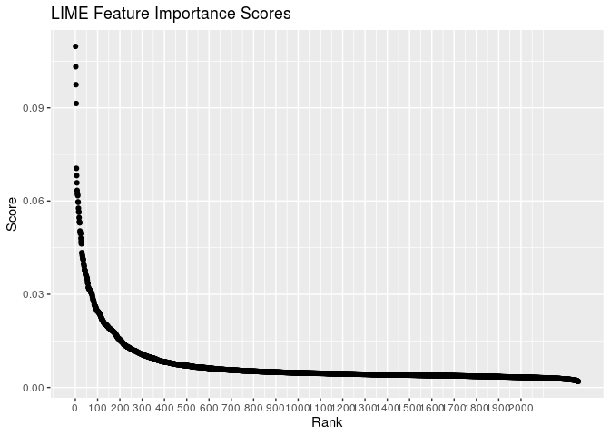
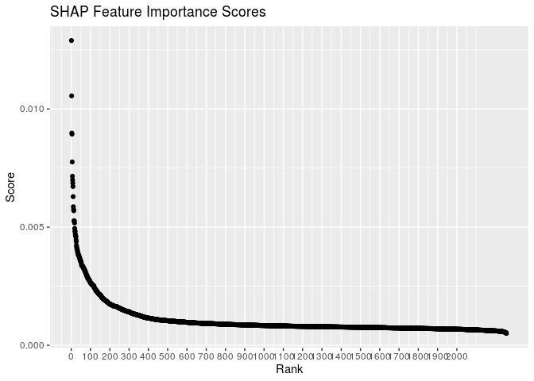
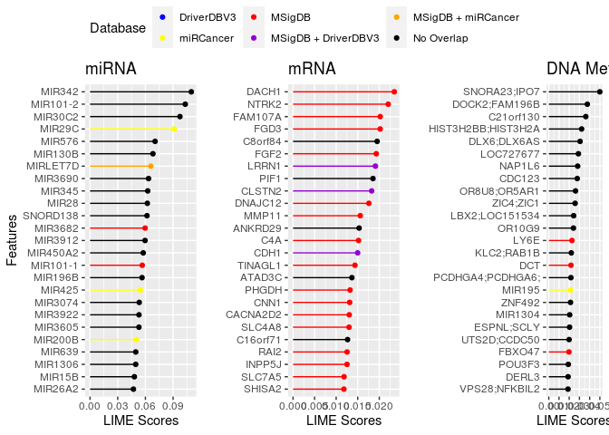
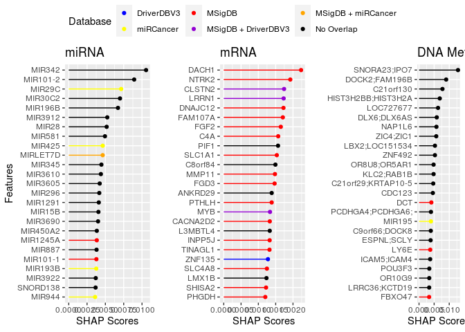

More plots with features
================

Importing libraries

``` r
library(tidyverse)
library(ggpubr)
```

Loading shap and lime values

``` r
lime <- read_csv("/data/users/bs16b001/logs/20210129/lime_1.csv")
shap <- read_csv("/data/users/bs16b001/logs/20210129/shap_1.csv", 
    col_types = cols(features = col_skip()))
shap <- rename(shap, features = features_1)
```

Plotting the importance values

LIME

``` r
lime %>%
  mutate(ranks = rank(-aggregate)) %>%
  ggplot(aes(x = ranks, y = aggregate))+
  geom_point()+
  labs(title = "LIME Feature Importance Scores", y = "Score", x = "Rank")+
  scale_x_continuous(breaks = seq(0,2000,100))
```

<!-- -->

SHAP

``` r
shap %>%
  mutate(ranks = rank(-shapley_values)) %>%
  ggplot(aes(x = ranks, y = shapley_values))+
  geom_point()+
  labs(title = "SHAP Feature Importance Scores", y = "Score", x = "Rank")+
  scale_x_continuous(breaks = seq(0,2000,100))
```

<!-- -->

# Variable Importance Plot

## LIME

Loading necessary data

``` r
lime <- read_csv("/data/users/bs16b001/logs/20210129/lime_1.csv")

meth <- read_csv("meth_top1000.csv")
mrna <- read_csv("mrna_top1000.csv")
mirna <- read_csv("mirna_anova.csv")

library(msigdbr)
all_gene_sets = msigdbr(species = "Homo sapiens")
```

Some data processing

``` r
lime$datatype <- NA
lime$datatype[lime$features %in% names(meth)] = "meth"
lime$datatype[lime$features %in% names(mrna)] = "mrna"
lime$datatype[lime$features %in% names(mirna)] = "mirna"

# MSigDB
selected_gs <- all_gene_sets %>% 
  filter(!gs_cat %in% c("C1", "C7", "C8")) %>% 
  filter(grepl("BREAST", gs_name)) %>%
  select(gs_name, gene_symbol)

msigdb <- unique(selected_gs$gene_symbol)


# DriverDBV3
mutations <- read_tsv("/data/users/bs16b001/genesets/mutation_download_tab.txt") %>%
  filter(cancer_type_abbr == "BRCA") %>%
  select(driver_gene)
```

    ## 
    ## ── Column specification ────────────────────────────────────────────────────────
    ## cols(
    ##   cancer_project = col_character(),
    ##   cancer_type_abbr = col_character(),
    ##   tool = col_character(),
    ##   driver_gene = col_character()
    ## )

``` r
methylation <- read_tsv("/data/users/bs16b001/genesets/methylation_download_tab.txt") %>%
  filter(cancer_type_abbr == "BRCA") %>%
  select(driver_gene)
```

    ## 
    ## ── Column specification ────────────────────────────────────────────────────────
    ## cols(
    ##   cancer_project = col_character(),
    ##   cancer_type_abbr = col_character(),
    ##   driver_gene = col_character()
    ## )

``` r
driverv3 <- union(unique(Reduce(c, str_split(mutations$driver_gene, ", "))), 
                  unique(Reduce(c, str_split(methylation$driver_gene, ", "))))


# miRCancer
miRCancer <- read_tsv("/data/users/bs16b001/genesets/miRCancerJune2020.txt") %>%
  filter(grepl("breast", Cancer)) %>%
  select(mirId)
```

    ## 
    ## ── Column specification ────────────────────────────────────────────────────────
    ## cols(
    ##   mirId = col_character(),
    ##   Cancer = col_character(),
    ##   Profile = col_character(),
    ##   `PubMed Article` = col_character()
    ## )

``` r
mirna_names <- unique(miRCancer$mirId)
str_sub(mirna_names, 1, 4) <- ""
str_sub(mirna_names, 4, 4) <- ""
mirna_names <- str_to_upper(mirna_names)
mirna_names <- sub("MIR133A-1", "MIR133A1", mirna_names)
mirna_names <- sub("MIR135A-1", "MIR135A1", mirna_names)
mirna_names <- sub("MIR181A-1", "MIR181A1", mirna_names)
mirna_names <- sub("MIR196A-1", "MIR196A1", mirna_names)
mirna_names <- sub("MIR196A-2", "MIR196A2", mirna_names)
mirna_names <- sub("MIR199A-1", "MIR199A1", mirna_names)
mirna_names <- sub("MIR199A-2", "MIR199A2", mirna_names)
mirna_names <- sub("MIR19B-1", "MIR19B1", mirna_names)
mirna_names <- sub("MIR19B-2", "MIR19B2", mirna_names)
mirna_names <- sub("MIR26A-1", "MIR26A1", mirna_names)
mirna_names <- sub("MIR26A-2", "MIR26A2", mirna_names)
mirna_names <- sub("MIR29B-1", "MIR29B1", mirna_names)
mirna_names <- sub("MIR30C-1", "MIR30C1", mirna_names)
mirna_names <- sub("MIR30C-2", "MIR30C2", mirna_names)
mirna_names <- sub("MIR320B-2", "MIR320B2", mirna_names)
mirna_names <- sub("MIR320D-1", "MIR320D1", mirna_names)
mirna_names <- sub("MIR320D-2", "MIR320D2", mirna_names)
mirna_names <- sub("MIR365-1", "MIR3651", mirna_names)
mirna_names <- sub("MIR365-2", "MIR3652", mirna_names)
mirna_names <- sub("MIR376A-1", "MIR376A1", mirna_names)
mirna_names <- sub("MIR450A-1", "MIR450A1", mirna_names)
mirna_names <- sub("MIR450A-2", "MIR450A2", mirna_names)
mirna_names <- sub("MIR514-1", "MIR514A1", mirna_names)
mirna_names <- sub("MIR514-2", "MIR514A2", mirna_names)
mirna_names <- sub("MIR514-3", "MIR514A3", mirna_names)
mirna_names <- sub("MIR550A-1", "MIR550A1", mirna_names)
mirna_names <- sub("MIR550A-2", "MIR550A2", mirna_names)
mirna_names <- sub("MIR92A-2", "MIR92A2", mirna_names)
mirna_names <- sub("LET7C", "MIRLET7C", mirna_names)
mirna_names <- sub("LET7D", "MIRLET7D", mirna_names)
mirna_names <- sub("LET7E", "MIRLET7E", mirna_names)
mirna_names <- sub("LET7F-1", "MIRLET7F1", mirna_names)
mirna_names <- sub("LET7G", "MIRLET7G", mirna_names)
mirna_names <- sub("MIR103-2", "MIR103A2", mirna_names)
mirna_names <- sub("MIR1245", "MIR1245A", mirna_names)
mirna_names <- sub("MIR1270-2", "MIR1270", mirna_names)
mirna_names <- sub("MIR151", "MIR151A", mirna_names)
mirna_names <- sub("MIR203", "MIR203A", mirna_names)
mirna_names <- sub("MIR219-1", "MIR219A1", mirna_names)
mirna_names <- sub("MIR323", "MIR323A", mirna_names)
mirna_names <- sub("MIR3607", "SNORD138", mirna_names)
mirna_names <- sub("MIR3647", "SNORD111B", mirna_names)
mirna_names <- sub("MIR451", "MIR451A", mirna_names)
mirna_names <- sub("MIR486", "MIR486-1", mirna_names)

miRCancer <- mirna_names
```

Reformatting
names

``` r
lime$features[lime$datatype == "mrna"] <- unlist(str_split(lime$features[lime$datatype == "mrna"], "\\|"))[ c(TRUE,FALSE) ]

lime$features[startsWith(lime$features, "PCDHGA4;PCDHGA6;")] <- "PCDHGA4;PCDHGA6;"
lime$features[startsWith(lime$features, "PCDHGA4;PCDHGA12;")] <- "PCDHGA4;PCDHGA12;"
lime$features[startsWith(lime$features, "MIR1304")] <- "MIR1304"

mirna_names <- lime$features[lime$datatype == "mirna"]
str_sub(mirna_names, 1, 4) <- ""
str_sub(mirna_names, 4, 4) <- ""
mirna_names <- str_to_upper(mirna_names)
mirna_names <- sub("MIR133A-1", "MIR133A1", mirna_names)
mirna_names <- sub("MIR135A-1", "MIR135A1", mirna_names)
mirna_names <- sub("MIR181A-1", "MIR181A1", mirna_names)
mirna_names <- sub("MIR196A-1", "MIR196A1", mirna_names)
mirna_names <- sub("MIR196A-2", "MIR196A2", mirna_names)
mirna_names <- sub("MIR199A-1", "MIR199A1", mirna_names)
mirna_names <- sub("MIR199A-2", "MIR199A2", mirna_names)
mirna_names <- sub("MIR19B-1", "MIR19B1", mirna_names)
mirna_names <- sub("MIR19B-2", "MIR19B2", mirna_names)
mirna_names <- sub("MIR26A-1", "MIR26A1", mirna_names)
mirna_names <- sub("MIR26A-2", "MIR26A2", mirna_names)
mirna_names <- sub("MIR29B-1", "MIR29B1", mirna_names)
mirna_names <- sub("MIR30C-1", "MIR30C1", mirna_names)
mirna_names <- sub("MIR30C-2", "MIR30C2", mirna_names)
mirna_names <- sub("MIR320B-2", "MIR320B2", mirna_names)
mirna_names <- sub("MIR320D-1", "MIR320D1", mirna_names)
mirna_names <- sub("MIR320D-2", "MIR320D2", mirna_names)
mirna_names <- sub("MIR365-1", "MIR3651", mirna_names)
mirna_names <- sub("MIR365-2", "MIR3652", mirna_names)
mirna_names <- sub("MIR376A-1", "MIR376A1", mirna_names)
mirna_names <- sub("MIR450A-1", "MIR450A1", mirna_names)
mirna_names <- sub("MIR450A-2", "MIR450A2", mirna_names)
mirna_names <- sub("MIR514-1", "MIR514A1", mirna_names)
mirna_names <- sub("MIR514-2", "MIR514A2", mirna_names)
mirna_names <- sub("MIR514-3", "MIR514A3", mirna_names)
mirna_names <- sub("MIR550A-1", "MIR550A1", mirna_names)
mirna_names <- sub("MIR550A-2", "MIR550A2", mirna_names)
mirna_names <- sub("MIR92A-2", "MIR92A2", mirna_names)
mirna_names <- sub("LET7C", "MIRLET7C", mirna_names)
mirna_names <- sub("LET7D", "MIRLET7D", mirna_names)
mirna_names <- sub("LET7E", "MIRLET7E", mirna_names)
mirna_names <- sub("LET7F-1", "MIRLET7F1", mirna_names)
mirna_names <- sub("LET7G", "MIRLET7G", mirna_names)
mirna_names <- sub("MIR103-2", "MIR103A2", mirna_names)
mirna_names <- sub("MIR1245", "MIR1245A", mirna_names)
mirna_names <- sub("MIR1270-2", "MIR1270", mirna_names)
mirna_names <- sub("MIR151", "MIR151A", mirna_names)
mirna_names <- sub("MIR203", "MIR203A", mirna_names)
mirna_names <- sub("MIR219-1", "MIR219A1", mirna_names)
mirna_names <- sub("MIR323", "MIR323A", mirna_names)
mirna_names <- sub("MIR3607", "SNORD138", mirna_names)
mirna_names <- sub("MIR3647", "SNORD111B", mirna_names)
mirna_names <- sub("MIR451", "MIR451A", mirna_names)
mirna_names <- sub("MIR486", "MIR486-1", mirna_names)

lime$features[lime$datatype == "mirna"] <- mirna_names
```

Some more data processing

I’ve made three lists of genes: msigdb, driverv3, and mircancer. Now I
just have to make three columns with values 1, 10, 100 for their being
inside those lists of genes. Then sum them up. Convert sum to character.
And then colour based on this character value.

``` r
lime$geneset1 <- 0
lime$geneset1[lime$features %in% msigdb] <- 100
lime$geneset2 <- 0
lime$geneset2[lime$features %in% driverv3] <- 10
lime$geneset3 <- 0
lime$geneset3[lime$features %in% miRCancer] <- 1

lime$geneset <- as.character(lime$geneset1 + lime$geneset2 + lime$geneset3)
lime <- select(lime, features, scores = aggregate, datatype, geneset)

lime$geneset <- recode(lime$geneset, 
                       "0" = "No Overlap",
                       "1" = "miRCancer",
                       "10" = "DriverDBV3",
                       "11" = "DriverDBV3 + miRCancer",
                       "100" = "MSigDB",
                       "101" = "MSigDB + miRCancer",
                       "110" = "MSigDB + DriverDBV3",
                       "111" = "MSigDB + DriverDBV3 + miRCancer")
```

Lollipop plot

``` r
plot_for_legend <- lime %>%
                  ggplot(aes(x = scores, y = features, colour = geneset))+
                  geom_point()+
                  theme(legend.position = "bottom")+
                  labs(colour = "Database")+
                  scale_colour_manual(values = c("No Overlap" = "Black",
                                                 "MSigDB" = "Red",
                                                 "DriverDBV3" = "Blue",
                                                 "miRCancer" = "Yellow",
                                                 "MSigDB + DriverDBV3" = "Darkviolet",
                                                 "DriverDBV3 + miRCancer" = "Green",
                                                 "MSigDB + miRCancer" = "Orange",
                                                 "MSigDB + DriverDBV3 + miRCancer" = "Azure2"))
mirna_plot <- lime %>%
                  filter(datatype == "mirna") %>%
                  slice_max(scores, n = 25) %>%
                  arrange(desc(scores)) %>%
                  mutate(features = fct_reorder(features, scores)) %>%
                  ggplot(aes(x = scores, y = features, colour = geneset))+
                  geom_segment(aes(x=0, xend=scores, y=features, yend=features))+
                  geom_point()+
                  theme(legend.position = "none")+
                  scale_colour_manual(values = c("No Overlap" = "Black", "MSigDB" = "Red", "DriverDBV3" = "Blue", "miRCancer" = "Yellow", "MSigDB + DriverDBV3" = "Darkviolet", "DriverDBV3 + miRCancer" = "Green", "MSigDB + miRCancer" = "Orange", "MSigDB + DriverDBV3 + miRCancer" = "Azure2"))+
                  labs(title = "miRNA", y = "Features", x = "LIME Scores")

mrna_plot <- lime %>%
                  filter(datatype == "mrna") %>%
                  slice_max(scores, n = 25) %>%
                  arrange(desc(scores)) %>%
                  mutate(features = fct_reorder(features, scores)) %>%
                  ggplot(aes(x = scores, y = features, colour = geneset))+
                  geom_segment(aes(x=0, xend=scores, y=features, yend=features))+
                  geom_point()+
                  theme(legend.position = "none")+
                  scale_colour_manual(values = c("No Overlap" = "Black", "MSigDB" = "Red", "DriverDBV3" = "Blue", "miRCancer" = "Yellow", "MSigDB + DriverDBV3" = "Darkviolet", "DriverDBV3 + miRCancer" = "Green", "MSigDB + miRCancer" = "Orange", "MSigDB + DriverDBV3 + miRCancer" = "Azure2"))+
                  labs(title = "mRNA", y = "", x = "LIME Scores")

meth_plot <- lime %>%
                  filter(datatype == "meth") %>%
                  slice_max(scores, n = 25) %>%
                  arrange(desc(scores)) %>%
                  mutate(features = fct_reorder(features, scores)) %>%
                  ggplot(aes(x = scores, y = features, colour = geneset))+
                  geom_segment(aes(x=0, xend=scores, y=features, yend=features))+
                  geom_point()+
                  theme(legend.position = "none")+
                  scale_colour_manual(values = c("No Overlap" = "Black", "MSigDB" = "Red", "DriverDBV3" = "Blue", "miRCancer" = "Yellow", "MSigDB + DriverDBV3" = "Darkviolet", "DriverDBV3 + miRCancer" = "Green", "MSigDB + miRCancer" = "Orange", "MSigDB + DriverDBV3 + miRCancer" = "Azure2"))+
                  labs(title = "DNA Methylation", y = "", x = "LIME Scores")


ggarrange(mirna_plot, mrna_plot, meth_plot,
          ncol = 3,
          legend.grob = get_legend(plot_for_legend))
```

<!-- -->

Top features

``` r
top_features <- lime %>%
  group_by(datatype) %>%
  select(!geneset) %>%
  slice_max(order_by=scores, n=25) %>%
  select(features) %>%
  as.vector()
```

    ## Adding missing grouping variables: `datatype`

``` r
paste(top_features$features[top_features$datatype == "mrna"], collapse = ", ")
```

    ## [1] "DACH1, NTRK2, FAM107A, FGD3, C8orf84, FGF2, LRRN1, PIF1, CLSTN2, DNAJC12, MMP11, ANKRD29, C4A, CDH1, TINAGL1, ATAD3C, PHGDH, CNN1, CACNA2D2, SLC4A8, C16orf71, RAI2, INPP5J, SLC7A5, SHISA2"

``` r
paste(top_features$features[top_features$datatype == "meth"], collapse = ", ")
```

    ## [1] "SNORA23;IPO7, DOCK2;FAM196B, C21orf130, HIST3H2BB;HIST3H2A, DLX6;DLX6AS, LOC727677, NAP1L6, CDC123, OR8U8;OR5AR1, ZIC4;ZIC1, LBX2;LOC151534, OR10G9, LY6E, KLC2;RAB1B, DCT, PCDHGA4;PCDHGA6;, MIR195, ZNF492, MIR1304, ESPNL;SCLY, UTS2D;CCDC50, FBXO47, POU3F3, DERL3, VPS28;NFKBIL2"

``` r
paste(top_features$features[top_features$datatype == "mirna"], collapse = ", ")
```

    ## [1] "MIR342, MIR101-2, MIR30C2, MIR29C, MIR576, MIR130B, MIRLET7D, MIR3690, MIR345, MIR28, SNORD138, MIR3682, MIR3912, MIR450A2, MIR101-1, MIR196B, MIR425, MIR3074, MIR3922, MIR3605, MIR200B, MIR639, MIR1306, MIR15B, MIR26A2"

## SHAP

Loading necessary data

``` r
shap <- read_csv("/data/users/bs16b001/logs/20210129/shap_1.csv", 
    col_types = cols(features = col_skip()))
```

    ## Warning: Duplicated column names deduplicated: 'features' => 'features_1' [2]

``` r
shap <- rename(shap, features = features_1)

meth <- read_csv("meth_top1000.csv")
```

    ## 
    ## ── Column specification ────────────────────────────────────────────────────────
    ## cols(
    ##   .default = col_double(),
    ##   patient_id = col_character()
    ## )
    ## ℹ Use `spec()` for the full column specifications.

``` r
mrna <- read_csv("mrna_top1000.csv")
```

    ## 
    ## ── Column specification ────────────────────────────────────────────────────────
    ## cols(
    ##   .default = col_double(),
    ##   patient_id = col_character()
    ## )
    ## ℹ Use `spec()` for the full column specifications.

``` r
mirna <- read_csv("mirna_anova.csv")
```

    ## 
    ## ── Column specification ────────────────────────────────────────────────────────
    ## cols(
    ##   .default = col_double(),
    ##   patient_id = col_character()
    ## )
    ## ℹ Use `spec()` for the full column specifications.

``` r
library(msigdbr)
all_gene_sets = msigdbr(species = "Homo sapiens")
```

Some data processing

``` r
shap$datatype <- NA
shap$datatype[shap$features %in% names(meth)] = "meth"
shap$datatype[shap$features %in% names(mrna)] = "mrna"
shap$datatype[shap$features %in% names(mirna)] = "mirna"

# MSigDB
selected_gs <- all_gene_sets %>% 
  filter(!gs_cat %in% c("C1", "C7", "C8")) %>% 
  filter(grepl("BREAST", gs_name)) %>%
  select(gs_name, gene_symbol)

msigdb <- unique(selected_gs$gene_symbol)


# DriverDBV3
mutations <- read_tsv("/data/users/bs16b001/genesets/mutation_download_tab.txt") %>%
  filter(cancer_type_abbr == "BRCA") %>%
  select(driver_gene)
```

    ## 
    ## ── Column specification ────────────────────────────────────────────────────────
    ## cols(
    ##   cancer_project = col_character(),
    ##   cancer_type_abbr = col_character(),
    ##   tool = col_character(),
    ##   driver_gene = col_character()
    ## )

``` r
methylation <- read_tsv("/data/users/bs16b001/genesets/methylation_download_tab.txt") %>%
  filter(cancer_type_abbr == "BRCA") %>%
  select(driver_gene)
```

    ## 
    ## ── Column specification ────────────────────────────────────────────────────────
    ## cols(
    ##   cancer_project = col_character(),
    ##   cancer_type_abbr = col_character(),
    ##   driver_gene = col_character()
    ## )

``` r
driverv3 <- union(unique(Reduce(c, str_split(mutations$driver_gene, ", "))), 
                  unique(Reduce(c, str_split(methylation$driver_gene, ", "))))


# miRCancer
miRCancer <- read_tsv("/data/users/bs16b001/genesets/miRCancerJune2020.txt") %>%
  filter(grepl("breast", Cancer)) %>%
  select(mirId)
```

    ## 
    ## ── Column specification ────────────────────────────────────────────────────────
    ## cols(
    ##   mirId = col_character(),
    ##   Cancer = col_character(),
    ##   Profile = col_character(),
    ##   `PubMed Article` = col_character()
    ## )

``` r
mirna_names <- unique(miRCancer$mirId)
str_sub(mirna_names, 1, 4) <- ""
str_sub(mirna_names, 4, 4) <- ""
mirna_names <- str_to_upper(mirna_names)
mirna_names <- sub("MIR133A-1", "MIR133A1", mirna_names)
mirna_names <- sub("MIR135A-1", "MIR135A1", mirna_names)
mirna_names <- sub("MIR181A-1", "MIR181A1", mirna_names)
mirna_names <- sub("MIR196A-1", "MIR196A1", mirna_names)
mirna_names <- sub("MIR196A-2", "MIR196A2", mirna_names)
mirna_names <- sub("MIR199A-1", "MIR199A1", mirna_names)
mirna_names <- sub("MIR199A-2", "MIR199A2", mirna_names)
mirna_names <- sub("MIR19B-1", "MIR19B1", mirna_names)
mirna_names <- sub("MIR19B-2", "MIR19B2", mirna_names)
mirna_names <- sub("MIR26A-1", "MIR26A1", mirna_names)
mirna_names <- sub("MIR26A-2", "MIR26A2", mirna_names)
mirna_names <- sub("MIR29B-1", "MIR29B1", mirna_names)
mirna_names <- sub("MIR30C-1", "MIR30C1", mirna_names)
mirna_names <- sub("MIR30C-2", "MIR30C2", mirna_names)
mirna_names <- sub("MIR320B-2", "MIR320B2", mirna_names)
mirna_names <- sub("MIR320D-1", "MIR320D1", mirna_names)
mirna_names <- sub("MIR320D-2", "MIR320D2", mirna_names)
mirna_names <- sub("MIR365-1", "MIR3651", mirna_names)
mirna_names <- sub("MIR365-2", "MIR3652", mirna_names)
mirna_names <- sub("MIR376A-1", "MIR376A1", mirna_names)
mirna_names <- sub("MIR450A-1", "MIR450A1", mirna_names)
mirna_names <- sub("MIR450A-2", "MIR450A2", mirna_names)
mirna_names <- sub("MIR514-1", "MIR514A1", mirna_names)
mirna_names <- sub("MIR514-2", "MIR514A2", mirna_names)
mirna_names <- sub("MIR514-3", "MIR514A3", mirna_names)
mirna_names <- sub("MIR550A-1", "MIR550A1", mirna_names)
mirna_names <- sub("MIR550A-2", "MIR550A2", mirna_names)
mirna_names <- sub("MIR92A-2", "MIR92A2", mirna_names)
mirna_names <- sub("LET7C", "MIRLET7C", mirna_names)
mirna_names <- sub("LET7D", "MIRLET7D", mirna_names)
mirna_names <- sub("LET7E", "MIRLET7E", mirna_names)
mirna_names <- sub("LET7F-1", "MIRLET7F1", mirna_names)
mirna_names <- sub("LET7G", "MIRLET7G", mirna_names)
mirna_names <- sub("MIR103-2", "MIR103A2", mirna_names)
mirna_names <- sub("MIR1245", "MIR1245A", mirna_names)
mirna_names <- sub("MIR1270-2", "MIR1270", mirna_names)
mirna_names <- sub("MIR151", "MIR151A", mirna_names)
mirna_names <- sub("MIR203", "MIR203A", mirna_names)
mirna_names <- sub("MIR219-1", "MIR219A1", mirna_names)
mirna_names <- sub("MIR323", "MIR323A", mirna_names)
mirna_names <- sub("MIR3607", "SNORD138", mirna_names)
mirna_names <- sub("MIR3647", "SNORD111B", mirna_names)
mirna_names <- sub("MIR451", "MIR451A", mirna_names)
mirna_names <- sub("MIR486", "MIR486-1", mirna_names)

miRCancer <- mirna_names
```

Reformatting
names

``` r
shap$features[shap$datatype == "mrna"] <- unlist(str_split(shap$features[shap$datatype == "mrna"], "\\|"))[ c(TRUE,FALSE) ]

shap$features[startsWith(shap$features, "PCDHGA4;PCDHGA6;")] <- "PCDHGA4;PCDHGA6;"
shap$features[startsWith(shap$features, "PCDHGA4;PCDHGA12;")] <- "PCDHGA4;PCDHGA12;"
shap$features[startsWith(shap$features, "MIR1304")] <- "MIR1304"

mirna_names <- shap$features[shap$datatype == "mirna"]
str_sub(mirna_names, 1, 4) <- ""
str_sub(mirna_names, 4, 4) <- ""
mirna_names <- str_to_upper(mirna_names)
mirna_names <- sub("MIR133A-1", "MIR133A1", mirna_names)
mirna_names <- sub("MIR135A-1", "MIR135A1", mirna_names)
mirna_names <- sub("MIR181A-1", "MIR181A1", mirna_names)
mirna_names <- sub("MIR196A-1", "MIR196A1", mirna_names)
mirna_names <- sub("MIR196A-2", "MIR196A2", mirna_names)
mirna_names <- sub("MIR199A-1", "MIR199A1", mirna_names)
mirna_names <- sub("MIR199A-2", "MIR199A2", mirna_names)
mirna_names <- sub("MIR19B-1", "MIR19B1", mirna_names)
mirna_names <- sub("MIR19B-2", "MIR19B2", mirna_names)
mirna_names <- sub("MIR26A-1", "MIR26A1", mirna_names)
mirna_names <- sub("MIR26A-2", "MIR26A2", mirna_names)
mirna_names <- sub("MIR29B-1", "MIR29B1", mirna_names)
mirna_names <- sub("MIR30C-1", "MIR30C1", mirna_names)
mirna_names <- sub("MIR30C-2", "MIR30C2", mirna_names)
mirna_names <- sub("MIR320B-2", "MIR320B2", mirna_names)
mirna_names <- sub("MIR320D-1", "MIR320D1", mirna_names)
mirna_names <- sub("MIR320D-2", "MIR320D2", mirna_names)
mirna_names <- sub("MIR365-1", "MIR3651", mirna_names)
mirna_names <- sub("MIR365-2", "MIR3652", mirna_names)
mirna_names <- sub("MIR376A-1", "MIR376A1", mirna_names)
mirna_names <- sub("MIR450A-1", "MIR450A1", mirna_names)
mirna_names <- sub("MIR450A-2", "MIR450A2", mirna_names)
mirna_names <- sub("MIR514-1", "MIR514A1", mirna_names)
mirna_names <- sub("MIR514-2", "MIR514A2", mirna_names)
mirna_names <- sub("MIR514-3", "MIR514A3", mirna_names)
mirna_names <- sub("MIR550A-1", "MIR550A1", mirna_names)
mirna_names <- sub("MIR550A-2", "MIR550A2", mirna_names)
mirna_names <- sub("MIR92A-2", "MIR92A2", mirna_names)
mirna_names <- sub("LET7C", "MIRLET7C", mirna_names)
mirna_names <- sub("LET7D", "MIRLET7D", mirna_names)
mirna_names <- sub("LET7E", "MIRLET7E", mirna_names)
mirna_names <- sub("LET7F-1", "MIRLET7F1", mirna_names)
mirna_names <- sub("LET7G", "MIRLET7G", mirna_names)
mirna_names <- sub("MIR103-2", "MIR103A2", mirna_names)
mirna_names <- sub("MIR1245", "MIR1245A", mirna_names)
mirna_names <- sub("MIR1270-2", "MIR1270", mirna_names)
mirna_names <- sub("MIR151", "MIR151A", mirna_names)
mirna_names <- sub("MIR203", "MIR203A", mirna_names)
mirna_names <- sub("MIR219-1", "MIR219A1", mirna_names)
mirna_names <- sub("MIR323", "MIR323A", mirna_names)
mirna_names <- sub("MIR3607", "SNORD138", mirna_names)
mirna_names <- sub("MIR3647", "SNORD111B", mirna_names)
mirna_names <- sub("MIR451", "MIR451A", mirna_names)
mirna_names <- sub("MIR486", "MIR486-1", mirna_names)

shap$features[shap$datatype == "mirna"] <- mirna_names
```

Some more data processing

I’ve made three lists of genes: msigdb, driverv3, and mircancer. Now I
just have to make three columns with values 1, 10, 100 for their being
inside those lists of genes. Then sum them up. Convert sum to character.
And then colour based on this character value.

``` r
shap$geneset1 <- 0
shap$geneset1[shap$features %in% msigdb] <- 100
shap$geneset2 <- 0
shap$geneset2[shap$features %in% driverv3] <- 10
shap$geneset3 <- 0
shap$geneset3[shap$features %in% miRCancer] <- 1

shap$geneset <- as.character(shap$geneset1 + shap$geneset2 + shap$geneset3)
shap <- select(shap, features, scores = shapley_values, datatype, geneset)

shap$geneset <- recode(shap$geneset, 
                       "0" = "No Overlap",
                       "1" = "miRCancer",
                       "10" = "DriverDBV3",
                       "11" = "DriverDBV3 + miRCancer",
                       "100" = "MSigDB",
                       "101" = "MSigDB + miRCancer",
                       "110" = "MSigDB + DriverDBV3",
                       "111" = "MSigDB + DriverDBV3 + miRCancer")
```

Lollipop plot

``` r
plot_for_legend <- shap %>%
                  ggplot(aes(x = scores, y = features, colour = geneset))+
                  geom_point()+
                  theme(legend.position = "bottom")+
                  labs(colour = "Database")+
                  scale_colour_manual(values = c("No Overlap" = "Black",
                                                 "MSigDB" = "Red",
                                                 "DriverDBV3" = "Blue",
                                                 "miRCancer" = "Yellow",
                                                 "MSigDB + DriverDBV3" = "Darkviolet",
                                                 "DriverDBV3 + miRCancer" = "Green",
                                                 "MSigDB + miRCancer" = "Orange",
                                                 "MSigDB + DriverDBV3 + miRCancer" = "Azure2"))
mirna_plot <- shap %>%
                  filter(datatype == "mirna") %>%
                  slice_max(scores, n = 25) %>%
                  arrange(desc(scores)) %>%
                  mutate(features = fct_reorder(features, scores)) %>%
                  ggplot(aes(x = scores, y = features, colour = geneset))+
                  geom_segment(aes(x=0, xend=scores, y=features, yend=features))+
                  geom_point()+
                  theme(legend.position = "none")+
                  scale_colour_manual(values = c("No Overlap" = "Black", "MSigDB" = "Red", "DriverDBV3" = "Blue", "miRCancer" = "Yellow", "MSigDB + DriverDBV3" = "Darkviolet", "DriverDBV3 + miRCancer" = "Green", "MSigDB + miRCancer" = "Orange", "MSigDB + DriverDBV3 + miRCancer" = "Azure2"))+
                  labs(title = "miRNA", y = "Features", x = "SHAP Scores")

mrna_plot <- shap %>%
                  filter(datatype == "mrna") %>%
                  slice_max(scores, n = 25) %>%
                  arrange(desc(scores)) %>%
                  mutate(features = fct_reorder(features, scores)) %>%
                  ggplot(aes(x = scores, y = features, colour = geneset))+
                  geom_segment(aes(x=0, xend=scores, y=features, yend=features))+
                  geom_point()+
                  theme(legend.position = "none")+
                  scale_colour_manual(values = c("No Overlap" = "Black", "MSigDB" = "Red", "DriverDBV3" = "Blue", "miRCancer" = "Yellow", "MSigDB + DriverDBV3" = "Darkviolet", "DriverDBV3 + miRCancer" = "Green", "MSigDB + miRCancer" = "Orange", "MSigDB + DriverDBV3 + miRCancer" = "Azure2"))+
                  labs(title = "mRNA", y = "", x = " SHAP Scores")

meth_plot <- shap %>%
                  filter(datatype == "meth") %>%
                  slice_max(scores, n = 25) %>%
                  arrange(desc(scores)) %>%
                  mutate(features = fct_reorder(features, scores)) %>%
                  ggplot(aes(x = scores, y = features, colour = geneset))+
                  geom_segment(aes(x=0, xend=scores, y=features, yend=features))+
                  geom_point()+
                  theme(legend.position = "none")+
                  scale_colour_manual(values = c("No Overlap" = "Black", "MSigDB" = "Red", "DriverDBV3" = "Blue", "miRCancer" = "Yellow", "MSigDB + DriverDBV3" = "Darkviolet", "DriverDBV3 + miRCancer" = "Green", "MSigDB + miRCancer" = "Orange", "MSigDB + DriverDBV3 + miRCancer" = "Azure2"))+
                  labs(title = "DNA Methylation", y = "", x = "SHAP Scores")


ggarrange(mirna_plot, mrna_plot, meth_plot,
          ncol = 3,
          legend.grob = get_legend(plot_for_legend))
```

<!-- -->

Top features

``` r
top_features <- shap %>%
  group_by(datatype) %>%
  select(!geneset) %>%
  slice_max(order_by=scores, n=25) %>%
  select(features) %>%
  as.vector()
```

    ## Adding missing grouping variables: `datatype`

``` r
paste(top_features$features[top_features$datatype == "mrna"], collapse = ", ")
```

    ## [1] "DACH1, NTRK2, CLSTN2, LRRN1, DNAJC12, FAM107A, FGF2, C4A, PIF1, SLC1A1, C8orf84, MMP11, FGD3, ANKRD29, PTHLH, MYB, CACNA2D2, L3MBTL4, INPP5J, TINAGL1, ZNF135, SLC4A8, LMX1B, SHISA2, PHGDH"

``` r
paste(top_features$features[top_features$datatype == "meth"], collapse = ", ")
```

    ## [1] "SNORA23;IPO7, DOCK2;FAM196B, C21orf130, HIST3H2BB;HIST3H2A, LOC727677, DLX6;DLX6AS, NAP1L6, ZIC4;ZIC1, LBX2;LOC151534, ZNF492, OR8U8;OR5AR1, KLC2;RAB1B, C21orf29;KRTAP10-5, CDC123, DCT, PCDHGA4;PCDHGA6;, MIR195, C9orf66;DOCK8, ESPNL;SCLY, LY6E, ICAM5;ICAM4, POU3F3, OR10G9, LRRC36;KCTD19, FBXO47"

``` r
paste(top_features$features[top_features$datatype == "mirna"], collapse = ", ")
```

    ## [1] "MIR342, MIR101-2, MIR29C, MIR30C2, MIR196B, MIR3912, MIR28, MIR581, MIR425, MIRLET7D, MIR345, MIR3610, MIR3605, MIR296, MIR1291, MIR15B, MIR3690, MIR450A2, MIR1245A, MIR887, MIR101-1, MIR193B, MIR3922, SNORD138, MIR944"
